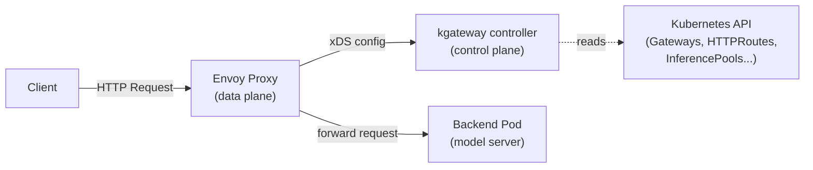
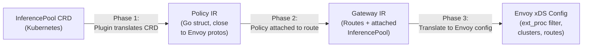
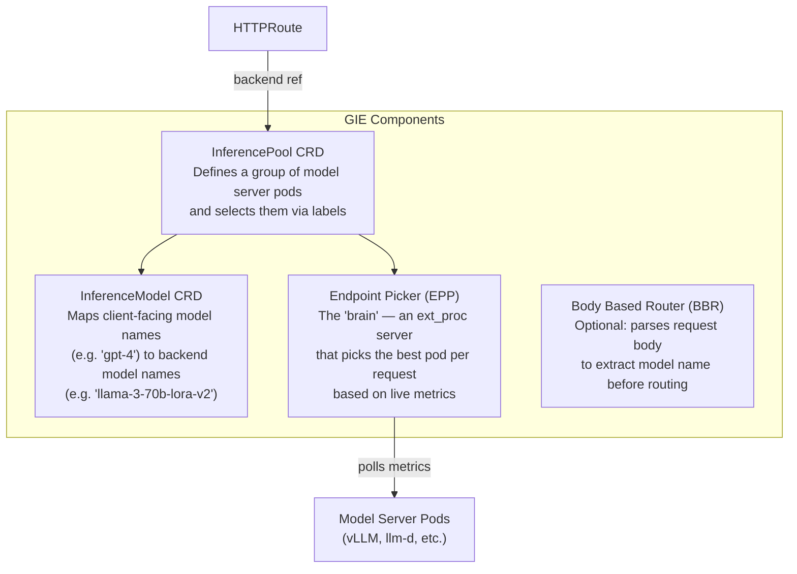
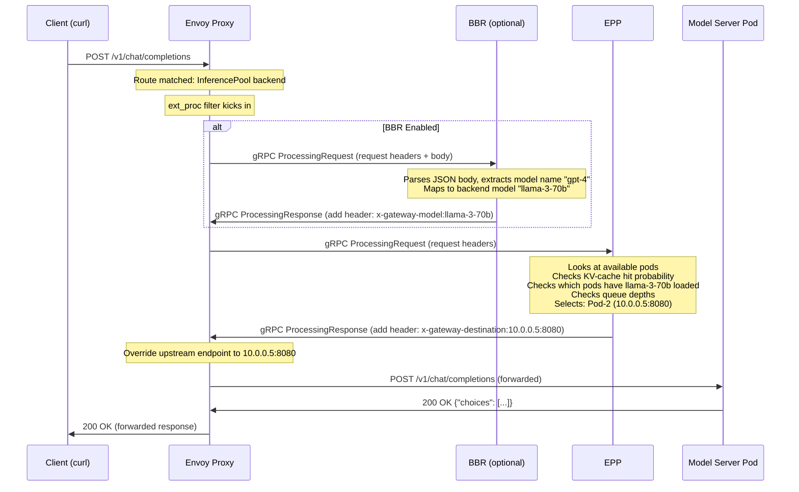
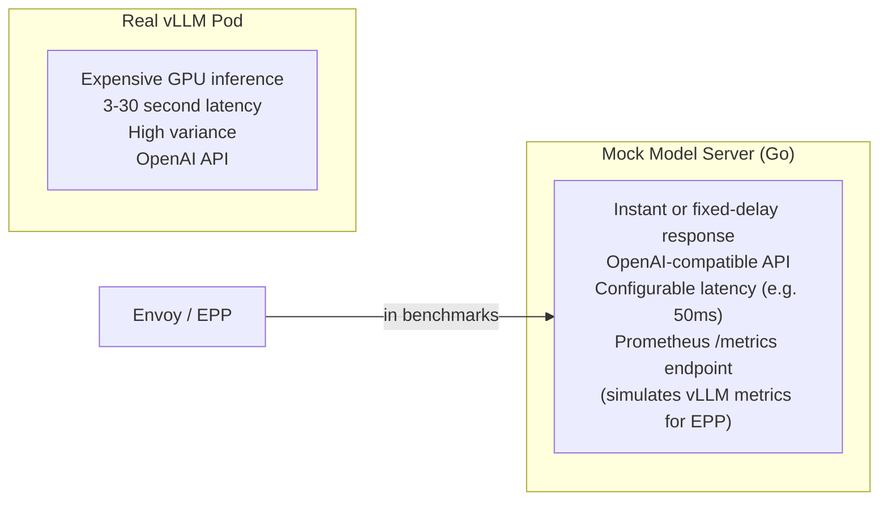
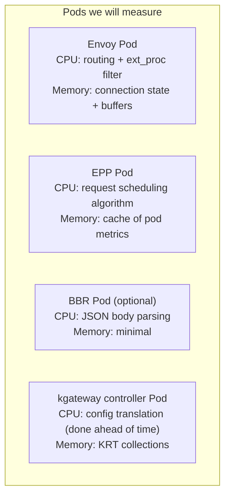
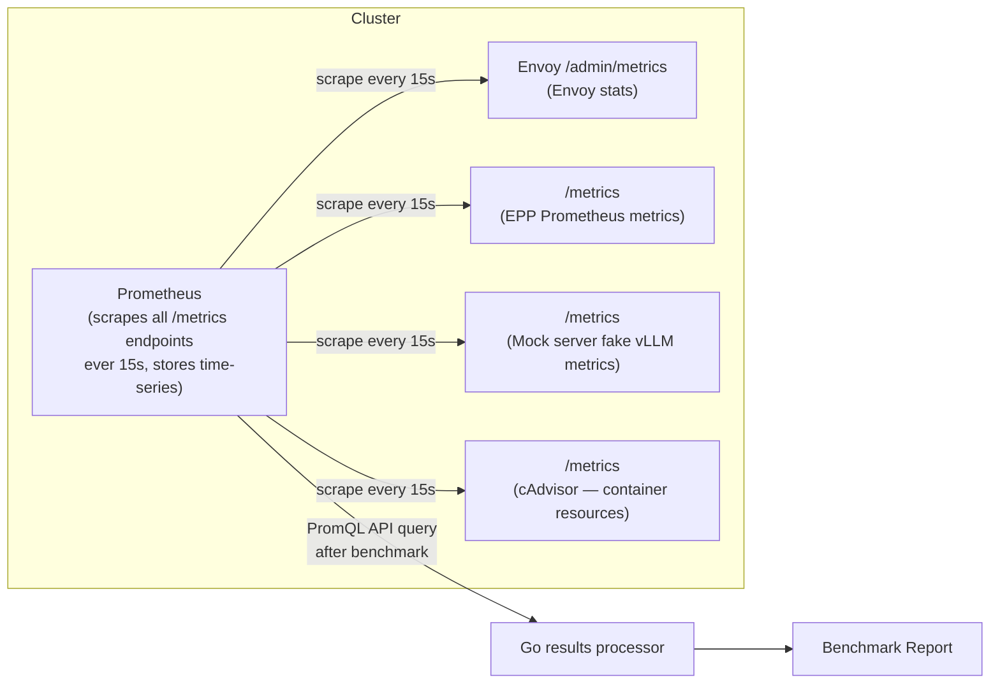
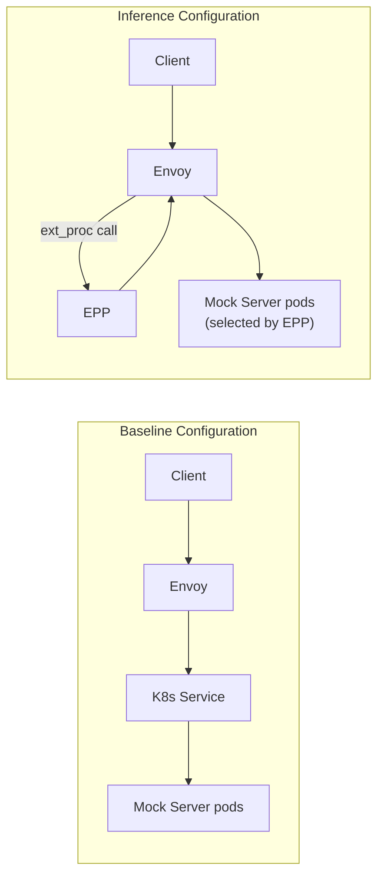

# Understanding Inference Routing Benchmarking in kgateway

## 1. The Big Picture

### The Problem We Are Solving

kgateway already does something important — it routes AI inference traffic from clients to model servers running inside Kubernetes (things like vLLM). The part that does the "smart routing" is a component called the **Endpoint Picker (EPP)**. The EPP is an external process that is called by Envoy (via the `ext_proc` filter) every time a request arrives, so it can decide: *which specific pod should handle this request?*

The EPP is doing something clever. Instead of simple round-robin, it looks at:
- Which pods have the query's context already cached in their GPU memory? (KV-cache awareness)
- Which pods have the right LoRA adapter loaded? (LoRA awareness)
- Which pods are too busy? (queue depth awareness)

This is smart, but it means every single inference request takes an **extra round-trip** — the request goes to Envoy, Envoy forwards it to the EPP over gRPC, the EPP thinks and responds, and then Envoy routes to the actual model pod.

**The problem is: nobody has measured how much this costs.** How many milliseconds does the EPP add to each request? Does it get slower under high load? Does it eat a lot of CPU and memory? Nobody knows. That is what this project measures.

### The End Goal

By the end of 6 weeks, someone should be able to:
1. Run `make benchmark-inference` on their laptop with a Kind cluster
2. Get a report that says: *"With inference routing enabled, p99 latency increased by X ms, throughput decreased by Y%, and the EPP uses Z millicores of CPU"*
3. Compare results across kgateway versions to catch regressions

---

## 2. Understanding the kgateway Data Plane

Before we can understand what we are measuring, we need to understand how kgateway works.

### Envoy Is the Data Plane

kgateway is a **control plane** — it does not actually handle your HTTP requests. Instead, it manages **Envoy proxy**, which is the thing that actually touches your packets.



kgateway reads your Kubernetes resources (Gateway, HTTPRoute, InferencePool) and translates them into Envoy configuration, which it pushes to Envoy via the xDS protocol. Envoy then uses that configuration to route requests.

**For benchmarking, this means:**
- We are benchmarking **Envoy** (the data plane), not the kgateway controller
- The controller does its work before requests arrive; we are measuring request-time cost

### The Translation Pipeline

When you apply an InferencePool to your cluster, kgateway goes through three phases:



This happens **before any requests arrive**. The ext_proc filter telling Envoy to send requests to the EPP is part of this translation. At request time, Envoy already has the configuration.

---

## 3. What Is the Gateway API Inference Extension?

### The Need for Smarter Routing

Regular load balancers use simple strategies: round-robin, least-connections, random. These work fine for stateless web servers because all backends are equivalent.

**LLM inference is different:**
- LLM servers use a KV-cache: if you send a request with a prompt that was seen before, the server can skip recomputing the attention weights for the cached prefix. This is a massive speedup.
- If you have 5 LLM pods and one of them has your prompt's context cached, routing to that pod is dramatically faster than routing elsewhere.
- LoRA adapters (fine-tuned model variants) may only be loaded on some pods. Routing to a pod without the adapter means it has to load it first.

The **Gateway API Inference Extension (GIE)** is Kubernetes-native machinery to solve this.

### The Key Components



### What is ext_proc?

`ext_proc` (External Processing) is an Envoy filter that allows an **external gRPC server** to participate in request/response processing. When Envoy receives a request, it can be configured to:
1. Pause processing
2. Send the request headers/body to the external server via gRPC
3. Wait for a response from the external server
4. Apply the modifications the server requests (e.g., add a header, change destination)
5. Continue routing with the updated context

The EPP is that external gRPC server. Every inference request must go through this ext_proc round-trip. That is the overhead we are measuring.

### InferencePool vs Regular K8s Service

| Feature | Kubernetes Service | InferencePool |
|---------|-------------------|---------------|
| Load balancing | Round-robin / iptables | EPP scheduling (KV-cache aware) |
| Backend awareness | None | Live metrics from model pods |
| Model routing | Not possible | Via InferenceModel CRD |
| LoRA adapter routing | Not possible | EPP knows which pods have which adapters |
| Cost | Zero (pure Envoy) | ext_proc round-trip per request |

---

## 4. How a Request Flows Through the Inference Gateway

Let's walk through step by step what happens when a client sends a request like:

```bash
curl http://my-gateway.example.com/v1/chat/completions \
  -d '{"model": "gpt-4", "messages": [{"role": "user", "content": "Hello!"}]}'
```

### Step-by-Step Flow



### Where Does Time Go?

From the benchmark perspective, total request latency = (time in Envoy without ext_proc) + (ext_proc overhead) + (model inference time). We want to isolate the middle term.

```
Total latency = [Envoy routing with no ext_proc] + [BBR ext_proc time] + [EPP ext_proc time] + [Model inference time]
                     ^--- Baseline scenario             ^--- Optional          ^--- Always present     ^--- Controlled by mock
```

By using a **mock model server** with a fixed, configurable latency, we hold model inference time constant, letting us isolate the ext_proc overhead.

---

## 5. What Is Benchmarking and Why Does It Matter Here?

### What Benchmarking Is

Benchmarking is the practice of running a **controlled experiment** to measure how fast a system is under defined conditions. "Controlled" is the key word — if conditions change between runs, results are not comparable.

### Types of Performance Problems We Are Looking For

1. **Added latency** — The EPP round-trip adds N milliseconds to every request. Is N acceptable? How does it grow with load?

2. **Throughput ceiling** — Without inference routing, Envoy may handle 10,000 req/s. With inference routing, does it drop to 7,000 because of the EPP bottleneck?

3. **Resource overhead** — The EPP pod itself uses CPU and memory. In a cluster with GPUs costing $10/hr, burning extra CPU on routing decisions has real cost.

4. **Tail latency growth** — p99 latency is the 99th percentile: out of every 100 requests, only 1 is slower than p99. For AI workloads, tail latency matters because slow responses feel broken to users.

5. **Load-dependent degradation** — At 10 RPS the EPP is fine; at 500 RPS it becomes the bottleneck and latency explodes. This is called a "hockey stick" curve and we want to find the inflection point.

### Baseline vs Delta Thinking

The most important thing we measure is not absolute latency but **the delta** between two configurations:

```
EPP overhead = latency(inference routing) - latency(baseline routing)
```

This cancels out any noise from the cluster, the network, or the mock server. The delta is what users care about: *"What am I paying for inference-aware routing?"*

---

## 6. The Mock Model Server — Why We Need a Fake AI

### The Core Problem

We cannot run real LLM inference during benchmarks because:
1. Real model inference takes **seconds to minutes** — far too slow to generate meaningful HTTP load numbers
2. Real models need **GPUs** — not available in CI environments (GitHub Actions runners)
3. Real models add **enormous variance** — response times vary based on prompt length and content
4. We would be **benchmarking the LLM**, not kgateway's routing layer

### What the Mock Server Does

The mock server mimics the API format of a real model server (OpenAI-compatible) while returning fake responses instantly (or with a configurable delay).



### Why Go for the Mock Server?

The proposal chooses Go because:
1. kgateway's entire test infrastructure is in Go
2. Easy to build into a Docker image and load into Kind (the local K8s setup)
3. No external dependencies (unlike Python)
4. The same project can use `go test ./...` to run everything

### The vLLM Metrics Endpoint

This is a subtle-but-important detail. The EPP does not just pick endpoints randomly — it **actively polls metrics** from each model server pod to make scheduling decisions. vLLM exposes metrics like:
- `vllm:num_requests_waiting` — how many requests are queued
- `vllm:gpu_cache_usage_perc` — how full the KV-cache is
- `vllm:num_requests_running` — current active requests

The EPP reads these to decide where to send the next request. Our mock server must expose these same metrics at `/metrics`, otherwise the EPP cannot function. The mock server will serve plausible-looking values (configurable queue depth, cache usage, etc.).

---

## 7. Load Generation

### What a Load Generator Does

A load generator sends many HTTP requests to your system and measures what comes back. Good load generators give you:
- **Controlled arrival rate** — send exactly N requests per second, not "as fast as possible"
- **Percentile metrics** — not just average latency (which lies) but p50, p95, p99
- **Configurable scenarios** — ramp up slowly, sustain, then spike

### Why Not Just Use `curl` or `wrk`?

`curl` is sequential (one request at a time). `wrk` is concurrent but limited scripting. For our use case we need:
- **SSE streaming support** — inference responses are streamed; not all tools handle this
- **Custom JSON bodies** — each request is a specific OpenAI chat completion payload
- **Multiple scenarios** — ramp-up profiles, different payload sizes
- **Prometheus-compatible output** — to store and compare results across runs

### Why k6?

k6 is a load testing tool built by Grafana Labs. It is:
- **Scripted in JavaScript** — easy to write complex request logic (build JSON body, parse SSE responses)
- **A single binary** — easy to install in CI; no runtime dependencies
- **Built for HTTP benchmarking** — first-class support for all the metrics we need
- **Extensible** — can push results to Prometheus via an official extension (xk6-output-prometheus-remote-write)

Here is a simplified k6 script to give you intuition:

```javascript
import http from 'k6/http';
import { check } from 'k6';

export const options = {
  // "ramping-arrival-rate" sends a FIXED number of requests per second
  // regardless of how long each one takes. This is more realistic than
  // "ramping-vus" which just has N concurrent users.
  scenarios: {
    ramp: {
      executor: 'ramping-arrival-rate',
      startRate: 10,
      timeUnit: '1s',
      preAllocatedVUs: 100,
      stages: [
        { target: 50, duration: '60s' },   // ramp up to 50 req/s over 60s
        { target: 200, duration: '60s' },  // ramp up to 200 req/s over 60s
        { target: 10, duration: '30s' },   // cool down
      ],
    },
  },
  // "thresholds" are pass/fail criteria — k6 exits with error if violated
  thresholds: {
    http_req_duration: ['p(99)<500'],   // fail if 99th percentile > 500ms
    http_req_failed: ['rate<0.01'],     // fail if error rate > 1%
  },
};

export default function () {
  const body = JSON.stringify({
    model: 'test-model',
    messages: [{ role: 'user', content: 'Hello world' }],
  });

  const res = http.post(`${__ENV.GATEWAY_URL}/v1/chat/completions`, body, {
    headers: { 'Content-Type': 'application/json' },
  });

  check(res, {
    'is 200': (r) => r.status === 200,
  });
}
```

The `__ENV.GATEWAY_URL` is injected from the Go harness, making every part of the system configurable without hardcoding URLs.

### The Load Profiles We Run

We run a **ramp-up profile** (not constant load) because:
- Constant load tells you how the system performs at one specific rate
- Ramp-up reveals the **hockey stick** — at what RPS does latency start exploding?

```
Latency
  ^                                                    ___/
  |                                               ____/
  |                                         _____/
  |       (flat = healthy range)     ______/
  |    _________________________________/
  +----------------------------------+---------+---------> RPS
                                 inflection  overload
                                 point
```

We want to find the inflection point for both baseline routing and inference routing.

---

## 8. Understanding Latency Metrics (p50, p95, p99)

### Why Not Average Latency?

Average latency hides the tail. Imagine 100 requests: 99 take 10ms, and 1 takes 10,000ms (10 seconds). The average is:

```
(99 × 10 + 1 × 10000) / 100 = 109.9ms
```

The average says "110ms" but a user got a 10-second response. **Percentiles are far more useful.**

### What Percentiles Mean

Running 1000 requests and sorting by latency:

| Percentile | Meaning |
|-----------|---------|
| **p50** | 50% of requests took this long or less. (The "median" — most typical experience) |
| **p95** | 95% of requests took this long or less. (Only 1 in 20 is slower) |
| **p99** | 99% of requests took this long or less. (Only 1 in 100 is slower) |

For AI inference routing, we care about:
- **p50** — what does a typical request feel like?
- **p95** — what does a power user who sends lots of requests experience?
- **p99** — what is the worst-case "tail" for your SLA? Most production SLAs are written at p99.

### What We Expect to See

With no inference extensions:
- p50: ~2-5ms (pure Envoy routing)
- p99: ~10-20ms

With inference extensions (EPP ext_proc):
- p50: ~5-15ms (adds EPP gRPC round-trip per request)
- p99: ~20-100ms (EPP becomes bottleneck under load)

The exact numbers are what we will discover. The point is the **delta** tells us the EPP's cost.

### Time to First Byte (TTFB) for Streaming

For streaming responses there is an important additional metric: **Time to First Byte (TTFB)**, also called "time to first token." This is how long the client waits before seeing any response content.

In non-streaming requests: latency = total time to get the full response.

In streaming requests: latency has two parts:
1. **TTFB** — time until the first SSE chunk arrives (includes EPP routing overhead)
2. **Streaming duration** — time to receive all subsequent chunks (model's generation speed)

The routing overhead only affects TTFB, not streaming duration. Our benchmarks will measure both separately.

---

## 9. Understanding Resource Overhead

### Why Resource Metrics Matter

If the EPP uses 500 millicores of CPU to serve 1000 req/s, that is a real cost. In production, that CPU comes at the expense of:
- Running more model server pods
- Running other services
- Your cloud bill

### The Components That Use Resources



### How We Measure It

We use **Prometheus** + **cAdvisor** (which runs on every Kubernetes node and reports container-level resource usage). We query:

```promql
# CPU usage of the EPP pod (in millicores)
rate(container_cpu_usage_seconds_total{pod=~"epp-.*"}[1m]) * 1000

# Memory usage of the EPP pod (in bytes)
container_memory_working_set_bytes{pod=~"epp-.*"}
```

We collect these metrics **during the load test** and report:
1. Baseline resource usage (no inference extensions)
2. Inference-enabled resource usage
3. Delta (the cost of inference routing)

---

## 10. Streaming vs Non-Streaming Inference

### What Is Streaming?

Most LLM APIs support two modes:

**Non-streaming** (default):
```
Client:  POST /v1/chat/completions (request)
                        [waits 3 seconds]
Server:  200 OK {"choices": [{"message": {"content": "Hello! I am Claude..."}}]}
```

**Streaming** (SSE — Server-Sent Events):
```
Client:  POST /v1/chat/completions (request, stream=true)
Server:  data: {"choices": [{"delta": {"content": "Hello"}}]}
         data: {"choices": [{"delta": {"content": "!"}}]}
         data: {"choices": [{"delta": {"content": " I"}}]}
         data: {"choices": [{"delta": {"content": " am"}}]}
         ... (one chunk per generated token)
         data: [DONE]
```

Streaming is preferred for interactive use because users start seeing output immediately instead of waiting for the full response.

### Why Streaming Is Different to Benchmark

1. **Connection duration** — streaming connections stay open much longer (until the full response is generated). At 500 RPS, if each connection lasts 5 seconds, Envoy needs to hold 2,500 concurrent open connections.

2. **ext_proc interaction** — for streaming, Envoy calls the EPP only at the **start** of the request (to pick the endpoint). The subsequent chunked response goes directly through Envoy without EPP involvement. This is good — the EPP cost is a one-time hit at request start.

3. **Back-pressure** — if the model server is slow, chunks arrive slowly, and the connection lingers. This can starve resources if too many slow streaming connections pile up.

4. **k6 SSE parsing** — our k6 scripts must read the SSE stream and measure TTFB (time until the first data: frame) and total stream duration separately.

### What We Benchmark for Streaming

| Metric | Description |
|--------|-------------|
| **TTFB** | Time from request start to first SSE chunk |
| **Total stream duration** | Time from first chunk to `[DONE]` frame |
| **Concurrent streams** | How many simultaneous streaming connections before Envoy degrades |
| **Error rate** | Disconnected streams, timeout rates |

---

## 11. Prometheus

### What Prometheus Is

Prometheus is an open-source metrics system widely used in the Kubernetes ecosystem. It works by **scraping** (polling) HTTP `/metrics` endpoints on your services at a regular interval (usually every 15 seconds) and storing the results as time-series data.

### How It Works in Our Setup



### Why Prometheus and Not Just Logging?

Logging raw numbers works for small experiments but becomes unmanageable when you have hundreds of metrics across dozens of pods over 30 minutes of test. Prometheus:
- **Stores data efficiently** — compressed time-series database
- **Makes querying easy** — PromQL is a powerful query language
- **Is already deployed** — the kgateway project uses Prometheus for its own metrics (`kgateway_collection_transforms_total`, etc.)
- **Integrates with Grafana** — for visual dashboards during manual benchmark runs

### Key PromQL Queries Used in the Report

```promql
# EPP average CPU over the benchmark window
avg_over_time(rate(container_cpu_usage_seconds_total{pod=~"epp-.*"}[1m])[30m:])

# Envoy's ext_proc stream count
envoy_ext_proc_streams_started{cluster="epp-cluster"}

# Envoy's p99 request latency (from Envoy's own histogram)
histogram_quantile(0.99, rate(envoy_http_downstream_rq_time_bucket[5m]))
```

---

## 12. The Benchmark Scenarios in Detail

### Scenario 1: Baseline vs Inference-Enabled

This is the most important scenario. We run **identical load** against two configurations:



**What changes between the two:**
- Baseline: `HTTPRoute` points to a regular `Service`
- Inference: `HTTPRoute` points to an `InferencePool`; Envoy's ext_proc filter routes through EPP

**What we measure:** The **absolute latency and throughput difference**. This is the "cost" of inference-aware routing.

### Scenario 2: EPP Configuration Variations

The EPP supports different modes. Each adds more complexity to the scheduling decision (and thus potentially more latency):

| Config | Complexity | Description |
|--------|-----------|-------------|
| **Default EPP** | Low | Basic load-balancing with queue-depth awareness |
| **EPP + BBR** | Medium | Adds body parsing for model name extraction |
| **Prefix-cache-aware** | High | EPP considers KV-cache hit probability |
| **LoRA-aware** | High | EPP routes based on which LoRA adapters are loaded |
| **Multiple InferenceModels** | Medium | Multiple model -> adapter mappings in one pool |

**Why this matters:** Different users deploy EPP differently. We want to show which configurations are "free" and which are "expensive" in terms of added latency.

### Scenario 3: Payload Size Impact

The EPP receives request headers (and in BBR's case, the full body) via ext_proc. Larger request bodies mean:
- More data to send over gRPC to EPP/BBR
- More JSON parsing time in BBR
- More time spent in the ext_proc filter layer

We test three payload sizes:
- **Small** (~0.5 KB): `"Hello"` prompt with 20-token context
- **Medium** (~2 KB): Typical chat history with 200-token context
- **Large** (~8 KB): Long document summarization with 2000-token context

### Scenario 4: Streaming Workloads

Run the same load profiles but with `"stream": true` in the request body. The mock server will respond with SSE chunks at a configurable rate (e.g., 1 chunk every 50ms for 20 chunks = 1 second of streaming).

**What we measure differently:**
- TTFB instead of total latency (only the routing matters, not the full stream)
- Concurrent connections at sustained streaming load
- Connection pool exhaustion behavior

---

## 13. The Go Test Harness

### What the Harness Does

The Go test harness is the "orchestrator" of the entire benchmark. It:

1. **Sets up the environment** — creates the Kind cluster, installs kgateway via Helm, applies GIE CRDs, deploys mock model servers, deploys Prometheus
2. **Runs k6** — invokes k6 as a subprocess, passing environment variables like `GATEWAY_URL` and `SCENARIO`
3. **Collects results** — reads k6's JSON output and queries Prometheus for resource metrics
4. **Generates reports** — produces Markdown and JSON reports
5. **Tears down** — cleans up the cluster

### Why Go Instead of a Shell Script?

You could do all of this in a shell script (`bash`). However:
- The kgateway project uses Go for its entire test infrastructure (`test/e2e/`)
- Go gives us proper error handling, types, and testing patterns
- The Go harness can integrate with `make benchmark` and even with `go test` directly
- Complex Kubernetes interactions (applying manifests, waiting for pods, port-forwarding) are much easier in Go with the `client-go` library

### Integration with kgateway's Existing Test Infrastructure

kgateway uses a testify-based e2e framework in `test/e2e/`. The benchmark harness will follow the same patterns:
- Use `testify` for test assertions and setup/teardown
- Use the same Kind cluster setup scripts
- Register as a suite that can be run with `make benchmark` (or `go test`)

This means benchmark runs use **identical cluster infrastructure** to e2e tests, minimizing "it works in benchmark but not in e2e" surprises.

---

## 14. CI/CD Integration

### Why Automate Benchmarks?

Without automation, benchmarks get run once (when setting up the framework) and then forgotten. Performance regressions creep in silently. With automation:
- Every release is benchmarked
- Regressions are caught before they ship
- Historical data shows trends

### When Do Benchmarks Run?

| Trigger | Why |
|---------|-----|
| **Nightly** | Regular check; catches regressions within 24 hours |
| **Release tags** | Official baseline data for each version |
| **Manual dispatch** | For on-demand investigation |
| **PRs (label-gated)** | `benchmark` label triggers it; not on every PR — too slow/expensive |

**Why not on every PR?** Benchmark runs take 20-40 minutes and require a full Kind cluster setup. Running this on every PR would make CI very slow and expensive. We gate it behind a label that maintainers can apply when a PR might affect performance.

### What the CI Workflow Looks Like

```yaml
# .github/workflows/benchmark.yaml (simplified)
name: Inference Routing Benchmarks

on:
  schedule:
    - cron: '0 2 * * *'  # Run at 2 AM UTC every night
  release:
    types: [published]
  workflow_dispatch:     # Manual trigger

jobs:
  benchmark:
    runs-on: ubuntu-22.04
    steps:
      - uses: actions/checkout@v4
      - name: Create Kind cluster
        run: make kind-create
      - name: Install kgateway with inference extension
        run: make deploy-kgateway HELM_VALUES=inference-enabled
      - name: Install k6
        run: go install go.k6.io/k6@latest
      - name: Run benchmarks
        run: make benchmark
      - name: Upload results
        uses: actions/upload-artifact@v4
        with:
          name: benchmark-results-${{ github.sha }}
          path: test/benchmark/results/
      - name: Comment on PR (if applicable)
        if: github.event_name == 'pull_request'
        uses: ...
```

### Regression Detection

The Go results processor will compare current results against a **stored baseline** (a JSON file committed to the repository with known-good numbers). If a metric regresses by more than a threshold (e.g., p99 latency increases by >20%), the CI job fails with a clear error message.

---

## 15. Key Design Decisions and Trade-offs

### Decision 1: k6 vs Custom Go Load Generator

**k6:**
- Pro: Rich scripting, built-in metrics, active community, extensions
- Pro: Handles SSE streaming natively via JS scripting
- Con: Another binary/dependency to install in CI
- Con: JavaScript, not Go (foreign language in a Go project)

**Custom Go:**
- Pro: Consistent with project language; no extra dependencies
- Pro: Can use existing e2e test helpers
- Con: Reinventing the wheel — metrics collection, reporting, all custom
- Con: SSE streaming support requires custom implementation

**Decision: k6 as primary, Go harness as orchestrator.** The harness calls k6 as a subprocess. This keeps the load generation logic clean in JavaScript while keeping the infrastructure in Go.

### Decision 2: Mock Server vs Real vLLM

**Mock server:**
- Pro: Works everywhere (CI, laptop, no GPU needed)
- Pro: Controllable, reproducible latency
- Con: Does not accurately represent real vLLM behavior
- Con: EPP scheduling decisions may be unrealistic

**Real vLLM:**
- Pro: Realistic workload
- Con: Requires GPU hardware (expensive in CI)
- Con: Response times vary by model and prompt (hard to isolate routing overhead)

**Decision: Mock server as default, real vLLM as an optional bonus.** The framework is designed so that you can replace the mock server URL with a real vLLM endpoint. This lets the framework be used both for isolated routing benchmarks (in CI) and realistic end-to-end performance testing (manually, with real hardware).

### Decision 3: Prometheus vs Simpler Metrics Collection

**Prometheus:**
- Pro: Already used by kgateway project
- Pro: Rich query language, time-series data
- Pro: Works with existing Grafana dashboards
- Con: Another component to deploy in the benchmark cluster

**CSV/Log-based collection:**
- Pro: Simple, no extra dependencies
- Con: Manual analysis, no time-series, hard to correlate across components

**Decision: Prometheus.** The complexity is justified because we need time-series data (how did CPU change as load increased?) and because kgateway already has Prometheus infrastructure.

---

## 16. Glossary

| Term | Definition |
|------|-----------|
| **ext_proc** | Envoy's External Processing filter — allows an external gRPC server to participate in request/response processing |
| **EPP** | Endpoint Picker — the ext_proc server in GIE that selects the optimal model server pod for each request |
| **BBR** | Body Based Router — optional ext_proc server that parses request bodies to extract model names |
| **GIE** | Gateway API Inference Extension — the upstream project that defines InferencePool, InferenceModel, EPP |
| **InferencePool** | Kubernetes CRD that defines a pool of model-serving backends |
| **InferenceModel** | Kubernetes CRD that maps client-facing model names to backend models/LoRA adapters |
| **SSE** | Server-Sent Events — HTTP streaming protocol where the server pushes data chunks to the client over one long-lived connection |
| **TTFB** | Time to First Byte — time from when a request is sent until the first byte of the response is received |
| **p50 / p95 / p99** | Latency percentiles: 50th, 95th, and 99th values in a sorted distribution of response times |
| **KV-cache** | Key-Value cache in LLM inference — stores previously computed attention weights to avoid recomputation for seen prompts |
| **LoRA** | Low-Rank Adaptation — a technique for fine-tuning LLMs efficiently; fine-tuned variants are called LoRA adapters |
| **xDS** | Envoy's control plane protocol — kgateway uses this to push config to Envoy |
| **Kind** | Kubernetes IN Docker — runs a full Kubernetes cluster inside Docker containers on your laptop; used for local development and CI |
| **Helm** | Kubernetes package manager — kgateway is installed via Helm charts |
| **Prometheus** | Open-source metrics scraping and storage system widely used in Kubernetes |
| **cAdvisor** | Container Advisor — Kubernetes-native daemon that reports container-level CPU and memory metrics |
| **PromQL** | Prometheus Query Language — used to query and compute metrics from the Prometheus database |
| **Control plane** | kgateway itself — the component that reads Kubernetes resources and translates them to Envoy config |
| **Data plane** | Envoy — the component that actually handles network traffic |
| **QPS / RPS** | Queries/Requests Per Second — throughput measure |
| **Hockey stick curve** | A latency-vs-throughput curve that is flat (healthy) up to a point and then shoots upward as the system is overloaded |
