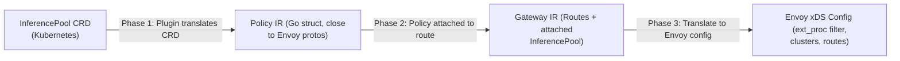

# Braindump for Inference Routing Benchmarking in kgateway

## Some key things to know

### First of all, how does model run on k8s?

```
Kubernetes Cluster
│
├── Regular Nodes (CPU only)
│   ├── kgateway pod
│   ├── EPP pod
│   └── other infra pods
│
└── GPU Nodes (special machines with GPUs attached)
    ├── vLLM pod  ← the model runs HERE
    ├── vLLM pod
    └── vLLM pod
```

- The GPU is physically inside the node (the machine). It's not separate.

- Cloud providers (AWS, GCP, Azure) let you rent GPU machines — like an A100 or H100 node.

- Kubernetes schedules the model-serving pod onto that GPU node because the pod requests GPU resources.

```
Client
      │
      │  HTTP POST /v1/chat/completions
      │  {"model": "llama-3", "messages": [...]}
      ↓
┌─────────────────────────────────────────────┐
│           Kubernetes Cluster                │
│                                             │
│  ┌──────────┐                               │
│  │ kgateway │  ← entry point, like a        │
│  │ (Envoy)  │    smart reverse proxy        │
│  └────┬─────┘                               │
│       │                                     │
│       │ ext-proc gRPC call                  │
│       ↓                                     │
│  ┌─────────┐                                │
│  │   EPP   │  ← "which pod should I use?"   │
│  │  (Pod)  │    checks queue depths,        │
│  └────┬────┘    model availability etc.     │
│       │                                     │
│       │ "send to vLLM-pod-2"                │
│       ↓                                     │
│  ┌──────────────────────────────────┐       │
│  │         GPU Node                 │       │
│  │  ┌────────────┐                  │       │
│  │  │ vLLM Pod   │                  │       │
│  │  │            │                  │       │
│  │  │ [GPU]──────│── model weights  │       │
│  │  │            │   in VRAM        │       │
│  │  └─────┬──────┘                  │       │
│  └────────┼─────────────────────────┘       │
└───────────┼─────────────────────────────────┘
            │
            │  HTTP response (generated tokens)
            ↓
          Client
```

### What is an InferencePool?
An InferencePool is a Kubernetes custom resource (CRD) that represents a group of AI model-serving backends — think of it like a smart load-balancer pool, but specifically designed for AI inference workloads.

A regular Kubernetes Service just groups pods by label. An InferencePool goes further — it knows things like:

Which pods are serving which models
What the queue depth / load is on each pod
Which pods support specific LoRA adapters

```yaml
# Rough idea of what it looks like
apiVersion: inference.networking.x-k8s.io/v1alpha2
kind: InferencePool
metadata:
  name: my-llm-pool
spec:
  selector:
    app: vllm-server    # which pods belong to this pool
  extensionRef:
    name: epp-service   # the EPP that makes routing decisions
```

### What is the Translation Pipeline?

The translation pipeline is the **process kgateway runs at configuration time** (before any traffic flows) to convert your Kubernetes resources into actual Envoy configuration.

### What is EPP?

EPP stands for Endpoint Picker Pod. It's the "brain" of the inference routing system — the external gRPC server that makes the actual smart routing decisions at request time.

```
Client Request
      ↓
   Envoy (kgateway)
      ↓
   [ext-proc call] ──→  EPP (Endpoint Picker Pod)
                              ↓
                        Looks at all pods in
                        the InferencePool and
                        picks the BEST one
                              ↓
                        Returns: "send this to pod-X"
      ↓
   Envoy forwards to pod-X
      ↓
   LLM Backend (e.g. vLLM)
```

### What is ext-proc?

ext-proc stands for External Processing. It's an Envoy proxy feature that allows an external gRPC server to inspect and modify HTTP requests/responses in-flight, mid-proxy.

Normally, when a request hits Envoy, Envoy routes it and that's it. With ext-proc, Envoy can pause the request and ask an external service: "Hey, what should I do with this?" — then act on that service's instructions before forwarding the request.

### What is GIE (Gateway Inference Extension)?

The Gateway Inference Extension (GIE) is the entire system that adds AI-awareness to a standard Kubernetes gateway.

```
┌─────────────────────────────────────────────┐
│         Gateway Inference Extension         │
│                                             │
│  ┌─────────────┐     ┌─────────────────┐   │
│  │ InferencePool│     │ InferenceModel  │   │
│  │    (CRD)    │     │     (CRD)       │   │
│  └─────────────┘     └─────────────────┘   │
│                                             │
│  ┌─────────────────────────────────────┐   │
│  │              EPP                    │   │
│  │  (the actual routing brain)         │   │
│  └─────────────────────────────────────┘   │
│                                             │
│  ┌─────────────────────────────────────┐   │
│  │         ext-proc interface          │   │
│  │  (how gateway talks to EPP)         │   │
│  └─────────────────────────────────────┘   │
└─────────────────────────────────────────────┘
```

## Project goal

using EPP means that  every single inference request takes an **extra round-trip** - the request goes to Envoy, Envoy forwards it to the EPP over gRPC, the EPP thinks and responds, and then Envoy routes to the actual model pod.

**we need to measure how much this costs.** How many milliseconds does the EPP add to each request? Does it get slower under high load? Does it eat a lot of CPU and memory?

- goal is to have tests that create report that says: *"With inference routing enabled, p99 latency increased by X ms, throughput decreased by Y%, and the EPP uses Z millicores of CPU"*
- Compare results across kgateway versions to catch regressions

## kgateway Data Plane

Envoy Is the Data Plane, kgateway is a **control plane** - it does not actually handle your HTTP requests.

This happens before any requests:

```
Kubernetes API (CRDs) 
        ↓
    kgateway controller reads them
        ↓
    kgateway translates to xDS config
        ↓
    pushes xDS config to Envoy
```

and during runtime, when client sends req:
```
Client
  ↓
Envoy  ← handles 100% of traffic directly
  ↓
(EPP if InferencePool attached)
  ↓
vLLM Backend Pod
```

- We are benchmarking Envoy, not the kgateway controller
- The controller does its work before requests arrive, we are measuring request-time cost

### The Translation Pipeline

When you apply an InferencePool to your cluster, kgateway goes through three phases:



This happens **before any requests arrive**. The ext_proc filter telling Envoy to send requests to the EPP is part of this translation. At request time, Envoy already has the configuration.

### inference-perf

It's a benchmarking tool specifically for LLM inference workloads, built by the Kubernetes community.

```
Regular load tester (k6, vegeta, fortio) + LLM-specific metrics (TTFT, TPOT, ITL) + Kubernetes/gateway awareness = inference-perf
```

This makes things a lot easier for us, we dont have to use multiple tools for load generation, metrics exposing, benchmarking etc. now. 

What it does:

1. Takes a dataset of real LLM prompts
2. Sends them to your gateway endpoint at configurable rates
3. Measures per-request: TTFT, TPOT, ITL, Total generation time, Token counts.

the upstream GIE project already uses this, we just need a similar implementation specific to kgateway.

How the upstream GIE project uses it:

```
Real prompts dataset                                      
        ↓                                                 
inference-perf                                            
        ↓                                                 
Gateway (with GIE)                                        
        ↓                                                 
vLLM on GPU                                              
        ↓                                                 
Results (they published them on their website)
```

### Regression Testing

Apart from inference-pref for benchmarking we will also do regression testing. Regression testing is basically testing done to make sure that new code changes did not break existing functionality.

So while we have a main benchmarking job (that will be done by inference-pref), we will also run regression testing againt a baseline that we store in some file. confirm that this is needed from maintainers.

```
Latency Profile Generator
      ↓
runs against Inference Gateway only
      ↓
compares against stored baseline
      ↓
pass or fail
```

### Prefill and Decode

Prefill is Processing the input prompt and Decode is Generating output tokens one by one.

```
User sends: "What is the capital of France?"

Prefill:
→ Model reads and processes the entire input prompt at once
→ This is what TTFT measures

Decode:
→ Model generates output tokens ONE BY ONE
→ Each token depends on the previous one
→ Happens repeatedly until response is complete
→ This is what TPOT/ITL measures
```

Some more terms you need to know, these are the senarios that GIE proj is also using as test cases, we will also benchmark for these cases:

- Prefix Cache Aware: When the model processes a prompt during prefill, it generates intermediate computations called Key-Value (KV) cache. If the same prompt prefix appears again, the model can reuse those computations instead of redoing them.

- Decode Heavy: Short input, very long output.

```
Input:  "Write me a detailed essay about climate change"
        (~50 tokens, quick prefill)
        ↓
Output: [500+ tokens of essay content]
```

- Prefill Heavy: Long input, short output - opposite of decode heavy.

- Multi-LoRA: This scenario just tests it at scale: Same pool of pods, multiple adapters:

```
Pod 1: base model + Medical LoRA loaded
Pod 2: base model + Legal LoRA loaded  
Pod 3: base model + Customer Service LoRA loaded
Pod 4: base model + Medical LoRA loaded
Mixed traffic comes in simultaneously:
Request 1: model="medical-llm"     → must go to Pod 1 or 4
Request 2: model="legal-llm"       → must go to Pod 2
Request 3: model="cs-llm"          → must go to Pod 3
Request 4: model="medical-llm"     → must go to Pod 1 or 4
```

NOTE: here we can also measure Routing accuracy. Did requests land on pods with correct adapter?

### The Need for Smarter Routing

Regular load balancers use simple strategies: round-robin, least-connections, random. These work fine for stateless web servers because all backends are equivalent.

**LLM inference is different:**
- LLM servers use a KV-cache: if you send a request with a prompt that was seen before, the server can skip recomputing the attention weights for the cached prefix. This is a massive speedup.
- If you have 5 LLM pods and one of them has your prompt's context cached, routing to that pod is dramatically faster than routing elsewhere.
- LoRA adapters (fine-tuned model variants) may only be loaded on some pods. Routing to a pod without the adapter means it has to load it first.

### Some more info about models and LoRA

I just found all this really interesting so documenting that :

- Base Model: When a company trains an LLM (like LLaMA, Mistral etc.), they train it on massive general internet data. The result is a base model - good at general tasks but not specialized for anything specific

- Fine-tuning: Fine-tuning means taking the base model and training it a little more on your specific domain data.

```
Base Model
      +
Medical documents, clinical notes, drug databases
      ↓
Fine-tuned Medical Model
```

- LoRA (Low-Rank Adaptation): It's a clever technique to fine-tune models very cheaply. The idea is that instead of modifying the billions of original model weights, just train a tiny set of new weights (the adapter) and add them on top of the original model.

```
Base Model weights (frozen, untouched)
         +
LoRA Adapter (tiny, ~10-100MB)
         =
Specialized Model behavior
```

### Where Does Time Go?

From the benchmark perspective, total request latency = (time in Envoy without ext_proc) + (ext_proc overhead) + (model inference time). We want to isolate the middle term.

```
Total latency = [Envoy routing with no ext_proc] + [BBR ext_proc time] + [EPP ext_proc time] + [Model inference time]
                     ^--- Baseline scenario             ^--- Optional          ^--- Always present     ^--- Controlled by mock
```

By using a **mock model server** with a fixed, configurable latency, we hold model inference time constant, letting us isolate the ext_proc overhead.

---

### What benchmarks /performance testing we need to do

1. **Added latency**: The EPP round-trip adds N milliseconds to every request. Is N acceptable? How does it grow with load?

2. **Throughput ceiling**: Without inference routing, Envoy may handle 10,000 req/s. With inference routing, does it drop to 7,000 because of the EPP bottleneck?

3. **Resource overhead**: The EPP pod itself uses CPU and memory. In a cluster with GPUs costing $10/hr, burning extra CPU on routing decisions has real cost.

4. find the latency (p90 etc.)

5. **Load-dependent degradation** — At 10 RPS the EPP is fine, at 500 RPS it becomes the bottleneck and latency explodes. This is called a "hockey stick" curve and we want to find the inflection point.

The most important thing we measure is not absolute latency but **the delta** between two configurations:

```
EPP overhead = latency(inference routing) - latency(baseline routing)
```

### We will need a Mock Model Server

We cannot run real LLM inference during benchmarks obv. mock server will mimic the API format of a real model server while returning fake responses instantly (or with a configurable delay).

Our Options:

#### 1. `llm-d-inference-sim`
GitHub: llm-d/llm-d-inference-sim

This was built specifically for this exact problem — testing infrastructure around the GIE without needing GPUs. (Written in Go, which aligns with kgateway's ecosystem) What it does that a naive mock server cannot:

- Real TTFB simulation — simulates the prefill phase latency with configurable jitter (not just a sleep)
- Inter-token latency — simulates decode phase delays between tokens (realistic SSE streaming)
- Load-adapting latency — automatically gets slower as concurrent requests increase (just like real vLLM)
- vLLM Prometheus metrics — exposes /metrics that the EPP actively scrapes for scheduling decisions (KV-cache, queue depth, LoRA adapters — all simulated)
- LoRA lifecycle simulation — simulates loading/unloading LoRA adapters and reports the right Prometheus metrics
- KV-cache simulation — the EPP can make real scheduling decisions based on simulated cache state
- Docker image available — can be loaded directly into Kind
- OpenAI-compatible API — /v1/chat/completions, streaming SSE, all of it

#### Option 2. GIE's own vLLM simulator
The GIE project maintains its own simple vLLM simulator for use in their quickstart guide (referenced in their docs at config/manifests/vllm/). It's simpler than llm-d-inference-sim - essentially a lightweight stand-in for their getting-started guide — but would also work if you just need something basic.

Instead of building a mock model server, we just:

- Pull llm-d-inference-sim as a container image in the benchmark manifests
- Configure it with the latency, LoRA adapters, and KV-cache parameters we want
- Point the InferencePool at it

(This saves probably 1–1.5 weeks of the estimated timeline since it was the most complex custom component to build. The EPP will also behave more realistically because llm-d-inference-sim simulates real metrics — KV-cache hits, queue depths — that actually influence EPP scheduling decisions.)

### The vLLM Metrics Endpoint

This is a subtle but important detail. The EPP does not just pick endpoints randomly - it **actively polls metrics** from each model server pod to make scheduling decisions. vLLM exposes metrics like:
- `vllm:num_requests_waiting` — how many requests are queued
- `vllm:gpu_cache_usage_perc` — how full the KV-cache is
- `vllm:num_requests_running` — current active requests

The EPP reads these to decide where to send the next request. Our mock server must expose these same metrics at `/metrics`, otherwise the EPP cannot function.

---

### Load Generation

We run a **ramp-up profile** (not constant load) because:
- Ramp-up reveals the **hockey stick** — at what RPS does latency start exploding?

```
Latency
  ^                                                    ___/
  |                                               ____/
  |                                         _____/
  |       (flat = healthy range)     ______/
  |    _________________________________/
  +----------------------------------+---------+---------> RPS
                                 inflection  overload
                                 point
```

We want to find the inflection point for both baseline routing and inference routing.

### Understanding Latency Metrics (p50, p95, p99)

### Why Not Average Latency?

Average latency hides the tail. Imagine 100 requests: 99 take 10ms, and 1 takes 10,000ms (10 seconds). The average is 109.9ms. The average says "110ms" but a user got a 10-second response. **Percentiles are far more useful.**

### What Percentiles Mean

Running 1000 requests and sorting by latency:

| Percentile | Meaning |
|-----------|---------|
| **p50** | 50% of requests took this long or less. (The "median") |
| **p95** | 95% of requests took this long or less. (Only 1 in 20 is slower) |
| **p99** | 99% of requests took this long or less. (Only 1 in 100 is slower) |

For AI inference routing, we care about:
- **p50** — what does a typical request feel like?
- **p95** — what does a power user who sends lots of requests experience?
- **p99** — what is the worst-case "tail" for your SLA? Most production SLAs are written at p99.

### Time to First Byte (TTFB) for Streaming

For streaming responses there is an important additional metric: **Time to First Byte (TTFB)**, also called "time to first token." This is how long the client waits before seeing any response content.

In non-streaming requests: latency = total time to get the full response.

In streaming requests: latency has two parts:
1. **TTFB** — time until the first SSE chunk arrives (includes EPP routing overhead)
2. **Streaming duration** — time to receive all subsequent chunks (model's generation speed)

The routing overhead only affects TTFB, not streaming duration. This maybe something we should also benchmark.

---

### Understanding Resource Overhead

If the EPP uses 500 millicores of CPU to serve 1000 req/s, that is a real cost. In production, that CPU comes at the expense of:
- Running more model server pods
- Running other services
- Your cloud bill

We will use **Prometheus** + **cAdvisor** (which runs on every Kubernetes node and reports container-level resource usage). We query:

```promql
# CPU usage of the EPP pod (in millicores)
rate(container_cpu_usage_seconds_total{pod=~"epp-.*"}[1m]) * 1000

# Memory usage of the EPP pod (in bytes)
container_memory_working_set_bytes{pod=~"epp-.*"}
```

We collect these metrics **during the load test** and report:
1. Baseline resource usage (no inference extensions)
2. Inference-enabled resource usage
3. and the delta (the cost of inference routing)

## 10. Streaming vs Non-Streaming Inference

### What Is Streaming?

Most LLM APIs support two modes:

- **Non-streaming** (default): client sends complete resp at once.

- **Streaming** (SSE — Server-Sent Events):

```
Client sends request
        ↓
Server generates token 1 → sends it immediately
Server generates token 2 → sends it immediately
Server generates token 3 → sends it immediately
     ↓
Client displays tokens as they arrive (like typing effect)
```

Streaming is preferred for interactive use because users start seeing output immediately instead of waiting for the full response.

### Why Streaming Is Different to Benchmark

1. **Connection duration** — streaming connections stay open much longer (until the full response is generated). At 500 RPS, if each connection lasts 5 seconds, Envoy needs to hold 2,500 concurrent open connections.

2. **ext_proc interaction** — for streaming, Envoy calls the EPP only at the **start** of the request (to pick the endpoint). The subsequent chunked response goes directly through Envoy without EPP involvement. This is good — the EPP cost is a one-time hit at request start.

3. **Back-pressure** — if the model server is slow, chunks arrive slowly, and the connection lingers. This can starve resources if too many slow streaming connections pile up.

Streaming introduces metrics that don't even exist in non-streaming: like Time to First Token (TTFT), Time Between Tokens (TBT), etc.

### What We Benchmark for Streaming

| Metric | Description |
|--------|-------------|
| **TTFB** | Time from request start to first SSE chunk |
| **Total stream duration** | Time from first chunk to `[DONE]` frame |
| **Concurrent streams** | How many simultaneous streaming connections before Envoy degrades |
| **Error rate** | Disconnected streams, timeout rates |

So we will write tests for non streaming model, but ask maintainers about these as well (as streaming is a more application than non streaming in llms)  

## Benchmark Scenarios

### 1. Baseline vs Inference-Enabled

This is the most important scenario. We run identical load against two configurations:

Client --> Envoy --> K8s Service --> Mock Server pods
and 
Client --> Envoy --> ext_proc call EPP --> Mock Server pods (selected by EPP)

**What changes between the two:**
- Baseline: `HTTPRoute` points to a regular `Service`
- Inference: `HTTPRoute` points to an `InferencePool`; Envoy's ext_proc filter routes through EPP

we measure the absolute latency and throughput difference. This is the "cost" of inference-aware routing.

### Scenario 2: EPP Configuration Variations

The EPP supports different modes. Each adds more complexity to the scheduling decision (and thus potentially more latency):

| configuration | complexity | description |
|--------|-----------|-------------|
| **Default EPP** | Low | Basic load-balancing with queue-depth awareness |
| **EPP + BBR** | Medium | Adds body parsing for model name extraction |
| **Prefix-cache-aware** | High | EPP considers KV-cache hit probability |
| **LoRA-aware** | High | EPP routes based on which LoRA adapters are loaded |
| **Multiple InferenceModels** | Medium | Multiple model -> adapter mappings in one pool |

### Scenario 3: Payload Size Impact

The EPP receives request headers (and in BBR's case, the full body) via ext_proc. Larger request bodies mean:
- More data to send over gRPC to EPP/BBR
- More JSON parsing time in BBR
- More time spent in the ext_proc filter layer

We test three payload sizes:
- **Small** (~0.5 KB): `"Hello"` prompt with 20-token context
- **Medium** (~2 KB): Typical chat history with 200-token context
- **Large** (~8 KB): Long document summarization with 2000-token context

### Scenario 4: Streaming Workloads (ask maintainers)

Run the same load profiles but with `"stream": true` in the request body. The mock server will respond with SSE chunks at a configurable rate (e.g., 1 chunk every 50ms for 20 chunks = 1 second of streaming).

**What we measure differently:**
- TTFB instead of total latency (only the routing matters, not the full stream)
- Concurrent connections at sustained streaming load
- Connection pool exhaustion behavior

### Integration with kgateway's Existing Test Infrastructure

we will
- Use `testify` for test assertions and setup/teardown
- Use the same Kind cluster setup scripts
- Register as a suite that can be run with `make benchmark` or something.

### CI/CD Integration

When Do Benchmarks Run?

| Trigger | Why |
|---------|-----|
| **Nightly** | Regular check; catches regressions within 24 hours (ask maintainers) |
| **Release tags** | Official baseline data for each version |
| **Manual dispatch** | For on-demand investigation |
| **PRs (label-gated)** | `benchmark` label triggers it; not on every PR — too slow/expensive |

Benchmark runs take 20-40 minutes and require a full Kind cluster setup. Running this on every PR would make CI very slow and expensive. We gate it behind a label that maintainers can apply when a PR might affect performance.

### Regression Detection

The Go results processor will compare current results against a **stored baseline** (a JSON file committed to the repository with known-good numbers). If a metric regresses by more than a threshold (e.g., p99 latency increases by >20%), the CI job fails with a clear error message.
