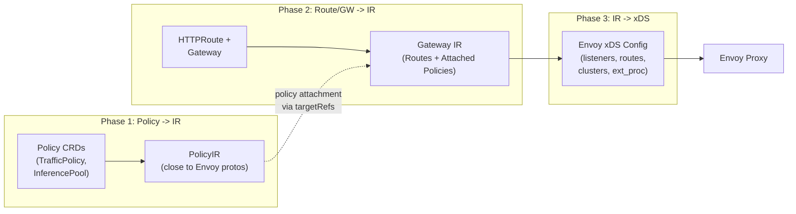
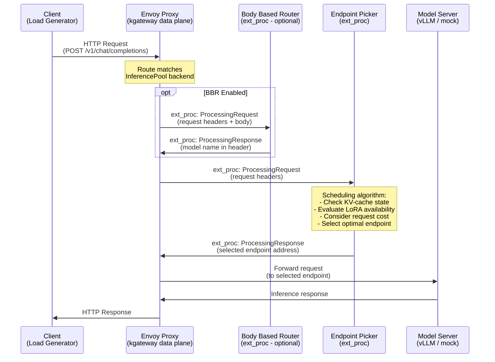
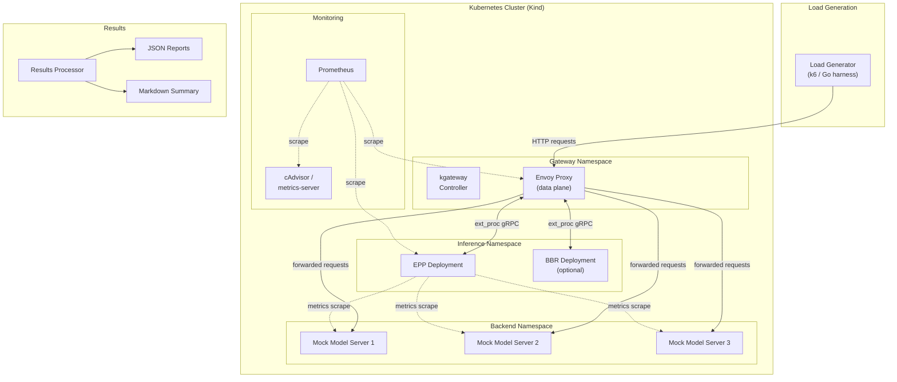
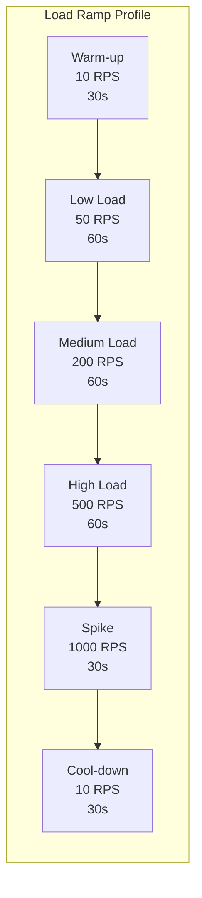
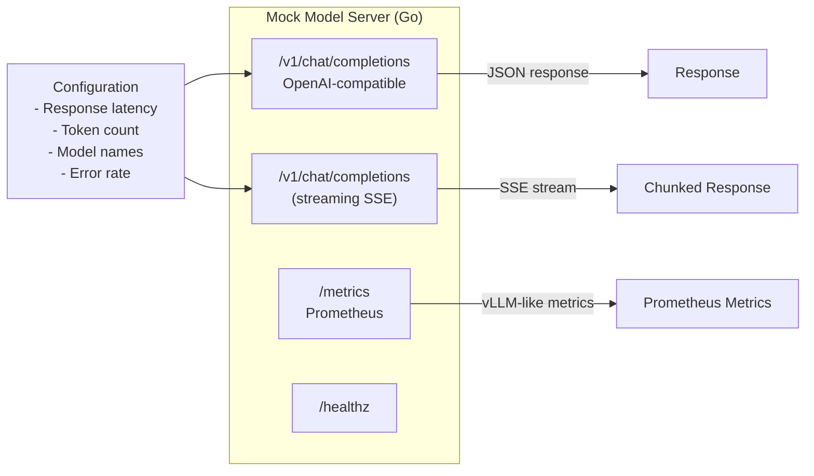
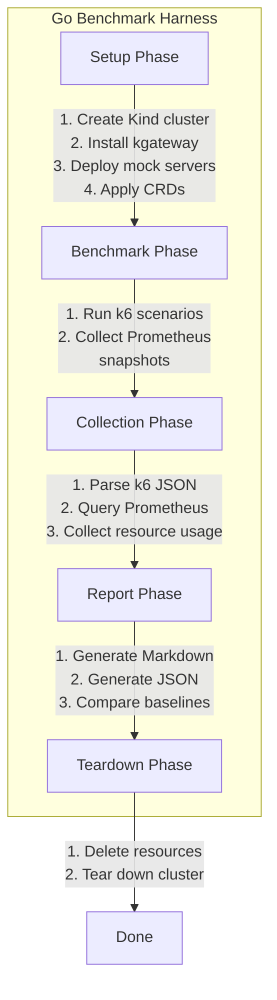
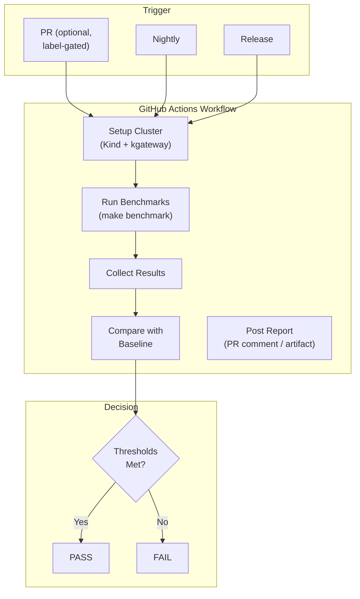
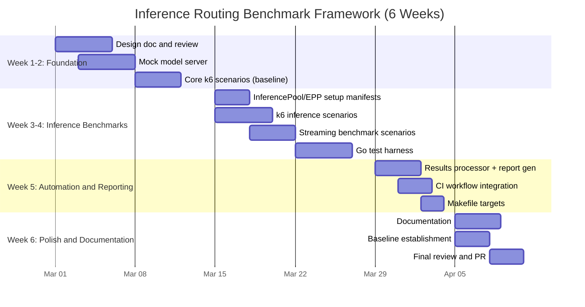

# Benchmarking and Performance Evaluation of Inference Routing Extensions in kgateway

## Table of Contents

- [1. Project Overview](#1-project-overview)
- [2. Background and Context](#2-background-and-context)
- [3. Architecture Deep-Dive](#3-architecture-deep-dive)
- [4. Benchmark Design](#4-benchmark-design)
- [5. Tools Selection and Analysis](#5-tools-selection-and-analysis)
- [6. Implementation Plan](#6-implementation-plan)
- [7. Metrics and Data Collection](#7-metrics-and-data-collection)
- [8. CI/CD Automation](#8-cicd-automation)
- [9. Documentation Plan](#9-documentation-plan)
- [10. Timeline and Milestones](#10-timeline-and-milestones)
- [11. TODO Checklist](#11-todo-checklist)

---

## 1. Project Overview

### Problem Statement

kgateway provides inference routing capabilities via the [Gateway API Inference Extension](https://github.com/kubernetes-sigs/gateway-api-inference-extension) (GIE). This integration enables model-aware routing, serving priority, and customizable load-balancing of self-hosted Generative AI models through Envoy's External Processing (ext_proc) filter.

However, there is **no standardized or reproducible way** to evaluate the performance impact of these inference routing extensions. Users and maintainers cannot quantify:
- How much latency does the inference routing layer add?
- What is the throughput ceiling with inference extensions enabled?
- What is the CPU/memory overhead of running the Endpoint Picker (EPP) and Body Based Router (BBR)?
- How do different EPP configurations and scheduling algorithms affect performance?

### Goals

1. Design and implement a **reproducible benchmarking framework** for inference routing extensions
2. Cover **multiple benchmark scenarios** (baseline vs inference, streaming vs unary, different EPP configs)
3. Collect **comprehensive metrics** (latency percentiles, throughput, resource overhead)
4. Provide **automated execution** via CI and documented scripts
5. Produce **clear documentation** for methodology, results interpretation, and best practices

### Relationship to Existing Work

> [!IMPORTANT]
> kgateway already has a load testing framework design at [design/11210](file:///home/shubham/Code/Personal/kgateway/design/11210-kgateway-load-testing-framework.md) focused on **control-plane scalability** (route attachment time, route propagation, configuration changes). This proposal is **complementary** -- it focuses on **data-plane performance** of the inference routing extensions specifically, measuring latency, throughput, and resource overhead when inference requests flow through the gateway.

---

## 2. Background and Context

### What is the Gateway API Inference Extension (GIE)?

The GIE is a Kubernetes-native system that transforms any ext-proc-capable gateway (like kgateway/Envoy) into an **Inference Gateway** optimized for serving Generative AI workloads.

**Key Components:**

| Component | Description |
|-----------|-------------|
| **InferencePool** | K8s CRD defining a pool of model-serving backends (e.g., vLLM pods) |
| **Endpoint Picker (EPP)** | ext_proc server that selects the optimal backend based on KV-cache state, LoRA adapter availability, request cost, etc. |
| **Body Based Router (BBR)** | Optional ext_proc server that parses request bodies to extract model names for routing |
| **InferenceModel** | CRD mapping client-facing model names to backend-specific models/adapters |

### How kgateway Integrates GIE

Based on [design/10411](file:///home/shubham/Code/Personal/kgateway/design/10411-gateway-api-inference-extension-support.md):

- GIE is implemented as a **kgateway plugin**
- The plugin manages Envoy's **External Processing Filter** (ext_proc) to route requests through the EPP
- **InferencePool** is added as a supported HTTPRoute backend reference
- A dedicated **deployer** manages EPP resources (Deployment, Service, etc.)
- The translation pipeline handles InferencePool references in HTTPRoutes

### kgateway Architecture (Translation Pipeline)



---

## 3. Architecture Deep-Dive

### Inference Request Flow (What We Are Benchmarking)



### Benchmark Architecture



---

## 4. Benchmark Design

### 4.1. Benchmark Scenarios

We define **four scenario categories** to comprehensively evaluate inference routing performance:

#### Scenario 1: Baseline vs Inference-Enabled Routing

> Compare standard kgateway routing (HTTPRoute -> Service) against inference-enabled routing (HTTPRoute -> InferencePool -> EPP -> Model Server).

| Aspect | Baseline | Inference-Enabled |
|--------|----------|-------------------|
| Backend ref | Kubernetes Service | InferencePool |
| ext_proc | None | EPP |
| Routing decision | Envoy round-robin | EPP scheduling algorithm |
| Purpose | Establish performance floor | Measure inference overhead |

**What we measure:** The raw overhead introduced by the inference routing path (EPP ext_proc call latency, additional network hops).

#### Scenario 2: EPP Configuration Variations

| Configuration | Description |
|--------------|-------------|
| **Default EPP** | Standard EPP with default scheduling parameters |
| **EPP + BBR** | EPP with Body Based Router for model-name extraction |
| **EPP with prefix-cache-aware scheduling** | EPP configured to optimize for KV-cache hits |
| **EPP with LoRA-aware scheduling** | EPP routing to endpoints with specific LoRA adapters loaded |
| **EPP with multiple InferenceModels** | Multiple model name mappings in a single InferencePool |

**What we measure:** Performance impact of different EPP features and scheduling algorithm complexity.

#### Scenario 3: Request/Response (Unary) Workloads

| Workload | Description | Payload |
|----------|-------------|---------|
| **Small prompt** | Short chat completion (< 100 tokens) | ~0.5 KB |
| **Medium prompt** | Moderate prompt (~500 tokens) | ~2 KB |
| **Large prompt** | Long-context prompt (~2000 tokens) | ~8 KB |

**What we measure:** How payload size affects latency through the inference routing path.

#### Scenario 4: Streaming Inference Workloads

| Workload | Description |
|----------|-------------|
| **SSE streaming** | Server-Sent Events chat completion streaming |
| **Non-streaming** | Standard request/response |
| **Mixed** | 50/50 mix of streaming and non-streaming |

**What we measure:** Streaming-specific overhead (time-to-first-token, chunk latency distribution).

### 4.2. Load Profiles



| Profile | Target RPS | Duration | Concurrent Clients | Purpose |
|---------|-----------|----------|--------------------| --------|
| **Warm-up** | 10 | 30s | 5 | Establish connections, warm caches |
| **Low sustained** | 50 | 60s | 10 | Baseline steady-state |
| **Medium sustained** | 200 | 60s | 50 | Typical production load |
| **High sustained** | 500 | 60s | 100 | Stress test |
| **Spike** | 1000 | 30s | 200 | Burst capacity |
| **Cool-down** | 10 | 30s | 5 | Recovery behavior |

### 4.3. Mock Model Server Design

Since we are benchmarking the **gateway routing layer**, not the model servers themselves, we use a **mock model server** that simulates realistic behavior without actual inference workloads:

```go
// Mock server capabilities:
// - Configurable response latency (simulates inference time)
// - OpenAI-compatible /v1/chat/completions endpoint
// - SSE streaming response support
// - Model-name echo in response
// - Configurable payload sizes
// - Prometheus metrics endpoint (simulating vLLM metrics for EPP)
// - Health check endpoint
```

The mock server will:
- Be written in **Go** (consistent with kgateway's test infrastructure)
- Expose a `/metrics` endpoint mimicking vLLM's metrics format (for EPP to scrape)
- Support configurable response latency via query param or header
- Return OpenAI-compatible JSON responses
- Support SSE streaming with configurable chunk count and inter-chunk delay

---

## 5. Tools Selection and Analysis

### 5.1. Load Generation Tools

| Tool | Language | Protocol Support | Scripting | Metrics | Cloud-Native | License |
|------|----------|-----------------|-----------|---------|--------------|---------|
| **k6** | Go (JS scripts) | HTTP/1.1, HTTP/2, gRPC, WebSocket | JavaScript ES6 | Built-in (p50/p95/p99, throughput, custom) | Extensions for K8s | AGPL-3.0 |
| **Locust** | Python | HTTP, custom | Python | Built-in + CSV export | Helm chart available | MIT |
| **vegeta** | Go | HTTP/1.1, HTTP/2 | CLI + Go library | JSON/HDR histogram output | Minimal | MIT |
| **fortio** | Go | HTTP, gRPC | CLI + Go library | JSON + HDR histogram | Istio ecosystem | Apache-2.0 |
| **ghz** | Go | gRPC only | CLI + Go library | JSON output | N/A | MIT |
| **Custom Go harness** | Go | Any | Native Go | Custom | Full control | N/A |

### 5.2. Recommended Primary Tool: k6

> [!TIP]
> **We recommend k6 as the primary load generation tool**, supplemented by a lightweight custom Go test harness for integration with kgateway's existing test infrastructure.

**Why k6?**

1. **JavaScript scripting** - Easy to write complex scenarios (streaming SSE parsing, model-name variations, ramp-up profiles)
2. **Built-in metrics** - Native p50/p95/p99 latency, throughput, error rates, custom metrics
3. **Scenarios and executors** - First-class support for ramp-up, constant-arrival-rate, shared-iterations
4. **Extensions ecosystem** - `xk6-output-prometheus-remote-write` for pushing metrics to Prometheus
5. **Thresholds** - Built-in pass/fail criteria for CI integration
6. **No external dependencies** - Single binary, no JVM or Python runtime needed
7. **Active community** - Grafana Labs maintains it; widely adopted for gateway/API benchmarking

**Why not the others?**

| Tool | Reason for Not Choosing as Primary |
|------|-----------------------------------|
| **Locust** | Python runtime adds dependency; less suitable for CI without pre-built images; weaker metrics out-of-the-box |
| **vegeta** | Great for simple HTTP benchmarks but lacks scripting for complex scenarios (SSE streaming, model rotation); no built-in ramp profiles |
| **fortio** | Good for Istio/Envoy ecosystem but limited scripting; less flexible than k6 for complex inference workload patterns |
| **ghz** | gRPC-only; our benchmarks target HTTP endpoints |
| **Custom Go only** | High maintenance burden; reinventing metrics, reporting, and load generation patterns |

### 5.3. Supplementary: Custom Go Test Harness

For **integration with kgateway's existing test infrastructure**, we will also write a Go test harness that:
- Integrates with the existing `test/e2e/` framework (testify-based)
- Can set up/tear down the benchmark environment (Kind cluster, kgateway install, InferencePool CRDs)
- Orchestrates k6 runs and collects results
- Provides `make` targets consistent with existing patterns (`make benchmark`, `make benchmark-inference`)

### 5.4. Metrics Collection Tool: Prometheus + cAdvisor

| Component | Purpose |
|-----------|---------|
| **Prometheus** | Scrape and store time-series metrics from Envoy, EPP, mock servers |
| **cAdvisor / metrics-server** | Container-level CPU and memory metrics |
| **kube-state-metrics** | Pod status, resource requests/limits |

**Why Prometheus?**
- kgateway already exposes Prometheus metrics (Envoy stats, kgateway control plane metrics)
- EPP and mock model servers can expose `/metrics` endpoints
- Standard in the Kubernetes ecosystem
- Easy to query with PromQL for report generation

**Alternative: OpenTelemetry Collector**
- Could be used as a unified collection pipeline, but adds complexity
- Prometheus is simpler for this use case and already part of the ecosystem

### 5.5. Results Processing and Reporting

| Tool | Purpose |
|------|---------|
| **k6 JSON output** | Raw benchmark results |
| **Go results processor** | Parse k6 JSON + Prometheus data, generate reports |
| **Markdown template** | Human-readable benchmark report |
| **JSON schema** | Machine-readable results for CI comparison |

---

## 6. Implementation Plan

### 6.1. Directory Structure

```
test/
  benchmark/
    README.md                          # Benchmark documentation
    Makefile                           # Benchmark-specific make targets
    cmd/
      mock-model-server/
        main.go                        # Mock OpenAI-compatible model server
        Dockerfile
    k6/
      scenarios/
        baseline_routing.js            # Scenario 1: baseline
        inference_routing.js           # Scenario 1: inference-enabled
        epp_configurations.js          # Scenario 2: EPP variations
        payload_sizes.js               # Scenario 3: unary workloads
        streaming.js                   # Scenario 4: streaming
      lib/
        openai.js                      # OpenAI request helper
        metrics.js                     # Custom metric definitions
        config.js                      # Shared configuration
      thresholds.json                  # Pass/fail thresholds for CI
    harness/
      setup.go                         # Cluster and kgateway setup
      teardown.go                      # Cleanup
      benchmark_test.go                # Go test entry points
      results.go                       # Results collection and processing
      report.go                        # Markdown report generation
    manifests/
      gateway.yaml                     # Gateway resource
      httproute-baseline.yaml          # Baseline HTTPRoute (-> Service)
      httproute-inference.yaml         # Inference HTTPRoute (-> InferencePool)
      inferencepool.yaml               # InferencePool CRD
      inferencemodel.yaml              # InferenceModel CRD
      mock-model-server.yaml           # Mock server Deployment + Service
      prometheus.yaml                  # Prometheus deployment for metrics
    results/
      .gitkeep                         # Results directory (gitignored)
    docs/
      methodology.md                   # Detailed methodology documentation
      interpreting-results.md          # Guide for reading reports
      best-practices.md                # Performance tuning guide
```

### 6.2. Component Implementation Details

#### Mock Model Server



**Key design decisions:**
- Written in **Go** for consistency with kgateway's test infrastructure and easy Docker builds
- Configurable via **environment variables** and **request headers** (e.g., `X-Mock-Latency: 100ms`)
- Exposes vLLM-compatible metrics for EPP to scrape (queue depth, KV-cache utilization, running requests)

#### k6 Test Scenarios

**Example: Baseline vs Inference Comparison Script**

```javascript
// k6/scenarios/inference_routing.js (conceptual)
import http from 'k6/http';
import { check, sleep } from 'k6';
import { Trend, Counter } from 'k6/metrics';

const ttfb = new Trend('time_to_first_byte');
const inferenceLatency = new Trend('inference_e2e_latency');

export const options = {
  scenarios: {
    ramp_up: {
      executor: 'ramping-arrival-rate',
      startRate: 10,
      timeUnit: '1s',
      preAllocatedVUs: 200,
      stages: [
        { target: 50, duration: '30s' },
        { target: 200, duration: '60s' },
        { target: 500, duration: '60s' },
        { target: 10, duration: '30s' },
      ],
    },
  },
  thresholds: {
    'http_req_duration{scenario:ramp_up}': ['p(95)<500', 'p(99)<1000'],
    'http_req_failed{scenario:ramp_up}': ['rate<0.01'],
  },
};

export default function () {
  const payload = JSON.stringify({
    model: 'test-model',
    messages: [{ role: 'user', content: 'Hello, world!' }],
  });

  const res = http.post(`${__ENV.GATEWAY_URL}/v1/chat/completions`, payload, {
    headers: { 'Content-Type': 'application/json' },
  });

  check(res, {
    'status is 200': (r) => r.status === 200,
    'has model in response': (r) => JSON.parse(r.body).model !== undefined,
  });

  inferenceLatency.add(res.timings.duration);
  ttfb.add(res.timings.waiting);
}
```

#### Go Benchmark Harness



### 6.3. Benchmark Execution Flow

```mermaid
flowchart LR
    subgraph "1. Environment Setup"
        K["Kind Cluster"]
        KG["kgateway Install"]
        GIE["GIE CRDs"]
        MS["Mock Model Servers"]
        PM["Prometheus"]
        K --> KG --> GIE --> MS --> PM
    end

    subgraph "2. Baseline Benchmarks"
        BL["Baseline HTTPRoute<br/>(no inference)"]
        BLR["Run k6 scenarios"]
        BLM["Collect baseline metrics"]
        BL --> BLR --> BLM
    end

    subgraph "3. Inference Benchmarks"
        IF["Inference HTTPRoute<br/>(with InferencePool)"]
        IFR["Run k6 scenarios"]
        IFM["Collect inference metrics"]
        IF --> IFR --> IFM
    end

    subgraph "4. Analysis"
        CMP["Compare baseline<br/>vs inference"]
        RPT["Generate reports"]
        CMP --> RPT
    end

    PM --> BL
    BLM --> IF
    IFM --> CMP
```



---

## 7. Metrics and Data Collection

### 7.1. Primary Metrics

| Metric | Source | Collection Method |
|--------|--------|-------------------|
| **End-to-end latency (p50/p95/p99)** | k6 | k6 built-in `http_req_duration` |
| **Time to first byte (TTFB)** | k6 | k6 built-in `http_req_waiting` |
| **Throughput (req/s)** | k6 | k6 built-in `http_reqs` rate |
| **Error rate** | k6 | k6 built-in `http_req_failed` |
| **Streaming time-to-first-token** | k6 custom | Custom k6 metric via SSE parsing |
| **Streaming inter-chunk latency** | k6 custom | Custom k6 metric |

### 7.2. Resource Overhead Metrics

| Metric | Target Pod(s) | Source |
|--------|--------------|--------|
| **CPU usage (cores)** | Envoy proxy, EPP, BBR, kgateway controller | Prometheus (cAdvisor / kubelet) |
| **Memory usage (bytes)** | Envoy proxy, EPP, BBR, kgateway controller | Prometheus (cAdvisor / kubelet) |
| **CPU usage delta** | Inference-enabled vs baseline | Calculated |
| **Memory usage delta** | Inference-enabled vs baseline | Calculated |

### 7.3. Envoy-Specific Metrics

| Metric | Source |
|--------|--------|
| **`envoy_http_downstream_rq_total`** | Envoy admin /stats |
| **`envoy_http_downstream_rq_time_bucket`** | Envoy histograms |
| **`envoy_cluster_upstream_rq_time_bucket`** | Envoy histograms |
| **`envoy_ext_proc_streams_started`** | Envoy ext_proc stats |
| **`envoy_ext_proc_streams_msgs_sent`** | Envoy ext_proc stats |
| **`envoy_ext_proc_streams_msgs_received`** | Envoy ext_proc stats |
| **`envoy_ext_proc_open_streams`** | Envoy ext_proc stats |

### 7.4. Report Format

A benchmark run generates:

1. **JSON report** - Machine-readable, used for CI regression detection:
   ```json
   {
     "timestamp": "2026-03-15T10:00:00Z",
     "version": "v2.3.0",
     "scenarios": {
       "baseline_routing": {
         "latency_p50_ms": 2.1,
         "latency_p95_ms": 5.3,
         "latency_p99_ms": 12.7,
         "throughput_rps": 4521,
         "error_rate": 0.001
       },
       "inference_routing": {
         "latency_p50_ms": 4.8,
         "latency_p95_ms": 11.2,
         "latency_p99_ms": 28.4,
         "throughput_rps": 3210,
         "error_rate": 0.002
       }
     },
     "overhead": {
       "latency_p50_increase_pct": 128.6,
       "throughput_decrease_pct": 29.0,
       "envoy_cpu_delta_millicores": 45,
       "epp_cpu_millicores": 120,
       "epp_memory_mb": 85
     }
   }
   ```

2. **Markdown report** - Human-readable summary with tables and sparkline-style indicators

---

## 8. CI/CD Automation

### 8.1. CI Workflow Integration



### 8.2. Makefile Targets

```makefile
# Primary benchmark targets (to be added to root Makefile)

.PHONY: benchmark
benchmark: ## Run all inference routing benchmarks
	cd test/benchmark && $(MAKE) run-all

.PHONY: benchmark-baseline
benchmark-baseline: ## Run baseline (no inference) benchmarks only
	cd test/benchmark && $(MAKE) run-baseline

.PHONY: benchmark-inference
benchmark-inference: ## Run inference-enabled benchmarks only
	cd test/benchmark && $(MAKE) run-inference

.PHONY: benchmark-report
benchmark-report: ## Generate benchmark report from latest results
	cd test/benchmark && $(MAKE) report

.PHONY: benchmark-compare
benchmark-compare: ## Compare latest results against baseline
	cd test/benchmark && $(MAKE) compare
```

### 8.3. GitHub Actions Workflow

A new workflow file `.github/workflows/benchmark.yaml` will define:
- **Trigger**: Nightly schedule, release tags, manual dispatch, PR with `benchmark` label
- **Environment**: `ubuntu-22.04` runner with Kind cluster
- **Steps**: Setup -> Install k6 -> Run benchmarks -> Collect results -> Compare -> Report
- **Artifacts**: JSON results and Markdown report uploaded as workflow artifacts
- **PR Comment**: On PR runs, post a summary as a PR comment

---

## 9. Documentation Plan

### Documents to Produce

| Document | Location | Description |
|----------|----------|-------------|
| **Benchmark README** | `test/benchmark/README.md` | Quick start, how to run locally |
| **Methodology** | `test/benchmark/docs/methodology.md` | Detailed methodology, scenario descriptions, assumptions |
| **Interpreting Results** | `test/benchmark/docs/interpreting-results.md` | How to read reports, what numbers mean, common patterns |
| **Best Practices** | `test/benchmark/docs/best-practices.md` | Performance tuning for inference routing, EPP configuration tips |
| **Design Document** | `design/XXXX-inference-routing-benchmarks.md` | Formal EP following kgateway's design doc template |

---

## 10. Timeline and Milestones

### 6-Week Implementation Timeline



### Milestone Deliverables

| Week | Milestone | Deliverables |
|------|-----------|-------------|
| **1-2** | Foundation | Design doc, mock model server, baseline k6 scenarios |
| **3-4** | Inference benchmarks | Full scenario suite, Go test harness, streaming support |
| **5** | Automation | CI workflow, results processor, regression detection |
| **6** | Polish | Documentation, baseline data, final PR |

---

## 11. TODO Checklist

### Phase 1: Foundation (Weeks 1-2)

- [ ] Write formal design document (`design/XXXX-inference-routing-benchmarks.md`)
- [ ] Get design doc reviewed and approved by maintainers
- [ ] Implement mock model server (`test/benchmark/cmd/mock-model-server/`)
  - [ ] OpenAI-compatible `/v1/chat/completions` endpoint
  - [ ] SSE streaming support
  - [ ] Configurable response latency
  - [ ] Prometheus `/metrics` endpoint (vLLM-compatible)
  - [ ] Dockerfile for Kind loading
- [ ] Create baseline k6 scenarios
  - [ ] `baseline_routing.js` - Standard HTTPRoute -> Service
  - [ ] Shared libraries (`openai.js`, `metrics.js`, `config.js`)
  - [ ] Threshold definitions (`thresholds.json`)
- [ ] Create Kubernetes manifests for baseline setup
  - [ ] Gateway, HTTPRoute, Service, Deployment for mock server
  - [ ] Prometheus stack for metrics collection

### Phase 2: Inference Benchmarks (Weeks 3-4)

- [ ] Create Kubernetes manifests for inference setup
  - [ ] InferencePool CRD
  - [ ] InferenceModel CRD
  - [ ] HTTPRoute referencing InferencePool
  - [ ] EPP deployment configuration
  - [ ] BBR deployment (optional scenario)
- [ ] Implement k6 inference scenarios
  - [ ] `inference_routing.js` - InferencePool routing
  - [ ] `epp_configurations.js` - Different EPP configs
  - [ ] `payload_sizes.js` - Variable payload benchmarks
  - [ ] `streaming.js` - SSE streaming benchmarks
- [ ] Implement Go test harness
  - [ ] `setup.go` - Cluster and environment setup
  - [ ] `teardown.go` - Cleanup procedures
  - [ ] `benchmark_test.go` - Test entry points (integrates with `make benchmark`)
  - [ ] `results.go` - Results collection from k6 + Prometheus

### Phase 3: Automation and Reporting (Week 5)

- [ ] Implement results processor
  - [ ] Parse k6 JSON output
  - [ ] Query Prometheus for resource metrics
  - [ ] Compute overhead deltas (inference vs baseline)
  - [ ] Generate JSON report
- [ ] Implement Markdown report generator
  - [ ] Latency comparison tables
  - [ ] Throughput comparison
  - [ ] Resource overhead summary
  - [ ] Pass/fail status
- [ ] Create CI workflow (`.github/workflows/benchmark.yaml`)
  - [ ] Kind cluster setup with kgateway
  - [ ] k6 installation
  - [ ] Benchmark execution
  - [ ] Results artifact upload
  - [ ] PR comment integration
- [ ] Add Makefile targets to root `Makefile`

### Phase 4: Documentation and Polish (Week 6)

- [ ] Write `test/benchmark/README.md` (quick start)
- [ ] Write `test/benchmark/docs/methodology.md`
- [ ] Write `test/benchmark/docs/interpreting-results.md`
- [ ] Write `test/benchmark/docs/best-practices.md`
- [ ] Establish initial performance baselines
  - [ ] Run full benchmark suite on reference hardware
  - [ ] Document baseline numbers
  - [ ] Set CI threshold values
- [ ] Final review and submit PR

---

## User Review Required

> [!IMPORTANT]
> **Questions for the contributor:**
> 1. Is the 6-week timeline realistic given your availability? Should we adjust scope per milestone?
> 2. Do you have access to a Kubernetes cluster with GPUs for running a real vLLM test, or should we scope exclusively to mock model servers?
> 3. Should the design document follow kgateway's existing template at [design/template.md](file:///home/shubham/Code/Personal/kgateway/design/template.md)?
> 4. Does the existing load testing framework work (EP-11210) need to be implemented first, or can this be done independently?
> 5. Do you want the k6 test scripts to be containerized (run k6 inside a K8s pod) or run from outside the cluster?
> 6. For CI, should benchmarks run on every PR (slow, expensive), nightly only, or label-gated on PRs?
