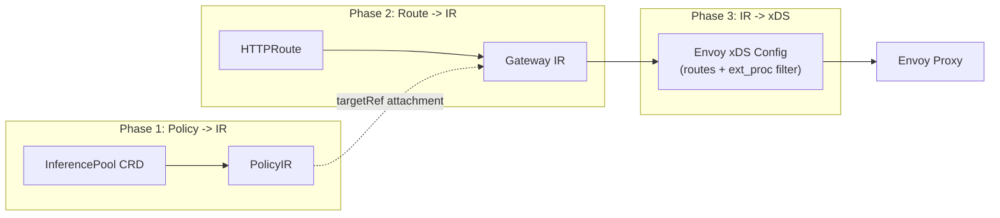
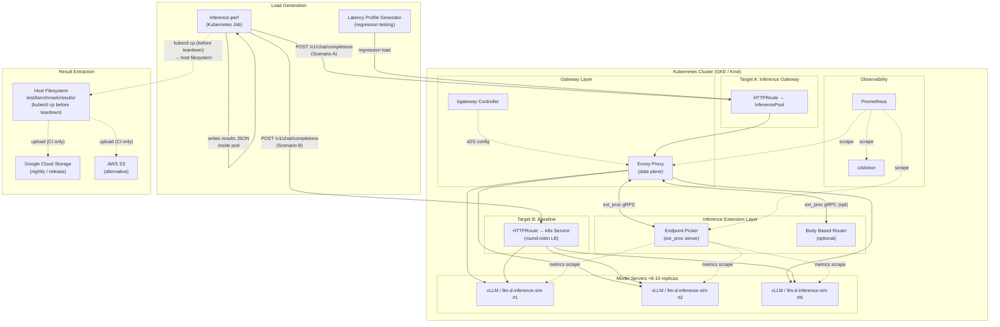
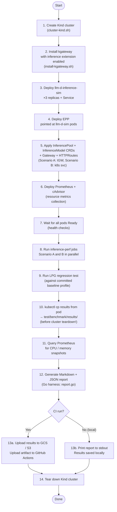
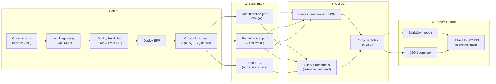
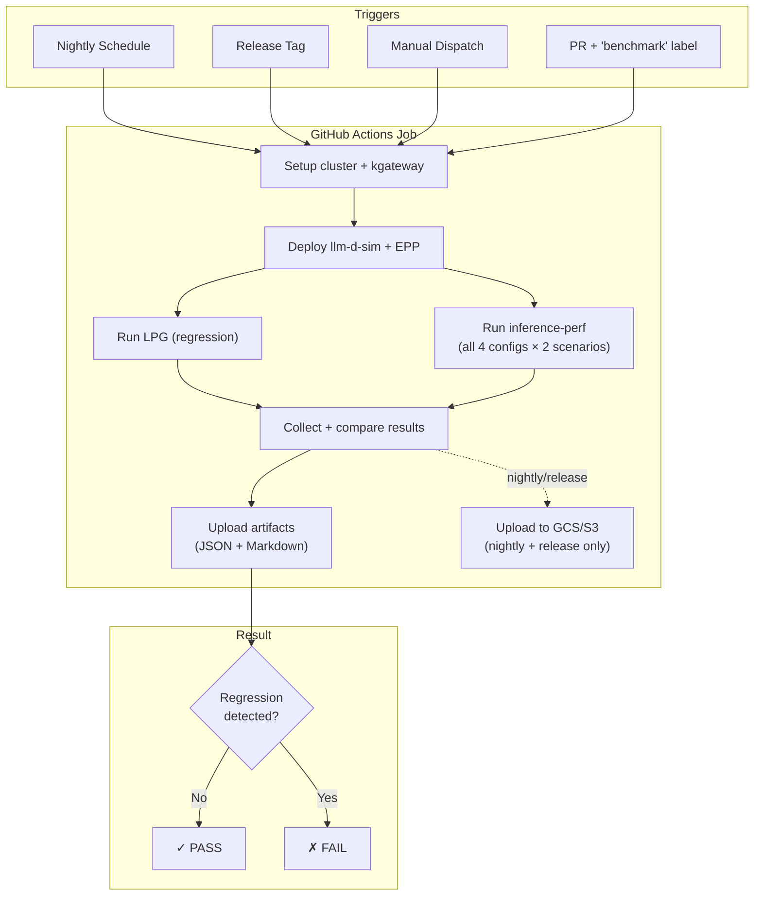
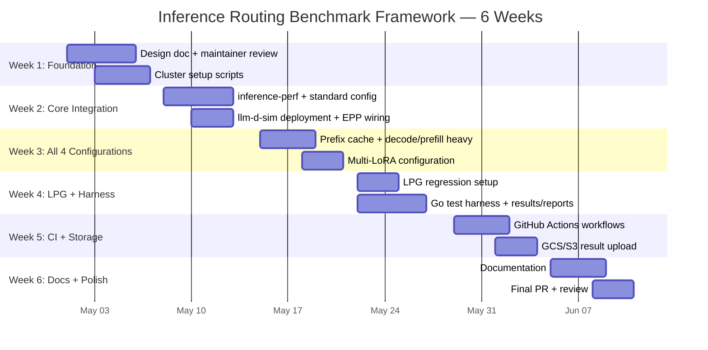

# Benchmarking and Performance Evaluation of Inference Routing Extensions in kgateway

## Table of Contents

- [1. Project Overview](#1-project-overview)
- [2. Background and Context](#2-background-and-context)
- [3. Test Setup Architecture](#3-test-setup-architecture)
- [4. Scope: GSoC Core vs Stretch Goals](#4-scope-gsoc-core-vs-stretch-goals)
- [5. Benchmark Configurations](#5-benchmark-configurations)
- [6. Tools Selection and Analysis](#6-tools-selection-and-analysis)
- [7. Implementation Plan](#7-implementation-plan)
- [8. Metrics and Data Collection](#8-metrics-and-data-collection)
- [9. CI/CD Automation](#9-cicd-automation)
- [10. Documentation Plan](#10-documentation-plan)
- [11. Timeline and Milestones](#11-timeline-and-milestones)
- [12. TODO Checklist](#12-todo-checklist)

---

## 1. Project Overview

### Problem Statement

kgateway provides inference routing capabilities via the [Gateway API Inference Extension](https://github.com/kubernetes-sigs/gateway-api-inference-extension) (GIE), enabling model-aware routing of self-hosted GenAI models through Envoy's `ext_proc` filter. There is currently **no standardized or reproducible way** to evaluate the performance impact of these extensions in kgateway:

- No published benchmarks comparing **kgateway + inference extension** vs **plain k8s Service**
- No reproducible test environment script for users to validate results
- No periodic CI job for inference perf regression testing
- No integration of perf regressions into the release process

### Goals

1. Publish benchmarks (**TPOT, ITL, TTFT, E2E latency**) comparing kgateway inference routing vs plain k8s service
2. Build **reproducible environment setup scripts** so users can validate results themselves
3. Implement a **periodic CI job** (nightly/weekly) against the `main` branch
4. Integrate benchmarks into the **release process** to gate on regressions
5. Document methodology and interpretation

### Relationship to Existing Work

> [!IMPORTANT]
> This is complementary to [design/11210](file:///home/shubham/Code/Personal/kgateway/design/11210-kgateway-load-testing-framework.md) (control-plane scale testing). This proposal targets **data-plane inference performance** — token latency, throughput, and routing overhead — following the same methodology as the [GIE upstream benchmark](https://gateway-api-inference-extension.sigs.k8s.io/performance/benchmark/).

---

## 2. Background and Context

### What is the Gateway API Inference Extension (GIE)?

| Component | Description |
|-----------|-------------|
| **InferencePool** | K8s CRD defining a pool of model-serving backends |
| **Endpoint Picker (EPP)** | ext_proc server selecting optimal backends via KV-cache/LoRA/queue-depth awareness |
| **Body Based Router (BBR)** | Optional ext_proc server parsing request bodies for model-name routing |
| **InferenceModel** | CRD mapping client model names to backend models/LoRA adapters |

### How kgateway Integrates GIE



---

## 3. Test Setup Architecture

This diagram shows how all components connect during a benchmark run. It mirrors the GIE upstream approach with kgateway-specific additions.



> [!NOTE]
> **What we are NOT including:** Jupyter notebook analysis, HuggingFace dataset downloads, or Looker Studio dashboards. These are part of the upstream GIE project's internal tooling. Our reporting will use Go-generated Markdown + JSON summaries, consistent with kgateway's existing test infrastructure.

### Test Setup Flow

Sequential steps for a complete benchmark run:



> [!IMPORTANT]
> **Step 10 (kubectl cp) must happen before cluster teardown.** `inference-perf` writes its JSON output inside the pod's filesystem. Since Kind runs locally and the cluster is deleted at the end, the Go harness extracts results to `test/benchmark/results/` on the host before calling teardown. In CI, this host path is then uploaded as a GitHub Actions artifact.

---

## 4. Scope: GSoC Core vs Stretch Goals

| # | GSoC Core (6 Weeks) | Description |
|---|---------------------|-------------|
| 1 | Reproducible setup scripts | One-command env setup using `llm-d-inference-sim` (no GPU) |
| 2 | `inference-perf` integration | Configure and wire up for kgateway-specific scenarios |
| 3 | IGW vs k8s service comparison | Side-by-side benchmark with TPOT/ITL/TTFT metrics |
| 4 | LPG regression testing | Latency Profile Generator for CI regression detection |
| 5 | **6** upstream test configs | Standard, Prefix-Cache High, Prefix-Cache Low, Decode Heavy, Prefill Heavy, Multi-LoRA |
| 6 | Result storage (local + GCS/S3) | Store JSON results; upload to cloud on release runs |
| 7 | Periodic CI job (nightly) | GitHub Actions workflow against `main` branch |
| 8 | Markdown + JSON reporting | Go-generated report; no Jupyter or external dashboards |
| 9 | Documentation | Methodology, how to reproduce, result interpretation |

| # | Stretch Goal | Blocker |
|---|-------------|---------|
| S1 | Real GPU env (B100 / H100 80GB, 8-10 replicas) | Cloud GPU budget / OSS credits |
| S2 | GKE-based e2e workflows (like upstream) | GPU env (S1) |
| S3 | Published benchmark page on kgateway website | Website infra access |
| S4 | Release process regression gate | Maintainer sign-off on thresholds |
| S5 | GPU utilization metrics | `inference-perf` roadmap |

---

## 5. Benchmark Configurations

We adopt the **6 workload profiles** from the upstream GIE benchmark, tailored for kgateway. All run against both targets (IGW vs k8s service) simultaneously.

### 5.0. Workload Summary Table

| Profile | Token Characteristics | QPS Stages | Primary Metric | Upstream Dataset |
|---------|----------------------|------------|----------------|-----------------|
| **Standard** | General purpose, mixed lengths | 10 → 20 → 30 | E2E latency, throughput | shareGPT |
| **Prefill-Heavy** | Long input (~2000 tokens), short output | 300 → 310 → 320 → 330 | TTFT p95/p99 | billsum_conversations |
| **Decode-Heavy** | Short input (~50 tokens), long output (~500+ tokens) | 200 → 210 → 220 | TPOT, ITL | infinity_instruct |
| **Prefix-Cache High** | Long system prompt (2048 tokens) + short question (256 tokens) | 100 → 300 → 500 | TTFT (cache hit delta) | shared_prefix |
| **Prefix-Cache Low** | Short system prompt (256 tokens) + long question (2048 tokens) | 100 → 300 → 500 | TTFT (cache miss cost) | shared_prefix |
| **Multi-LoRA** | Decode-heavy, mixed across 15 LoRA adapters | 20 → 200 | Per-adapter TPOT, error rate | infinity_instruct |

### 5.1. Why We Don't Use the Upstream Real Datasets

> [!NOTE]
> The upstream GIE benchmarks use real NLP datasets (shareGPT, billsum, infinity_instruct) because they benchmark **actual vLLM inference** — the model needs realistic prompts to produce meaningful token timing data.
>
> **kgateway's benchmark tests the gateway routing layer, not model inference.** We use `llm-d-inference-sim` which simulates responses without processing prompt content. It uses configurable token distributions to replicate the *shape* of each workload (input length, output length, arrival rate) without requiring:
> - HuggingFace tokens or API access
> - Large dataset downloads (shareGPT is ~700 MB)
> - GPU to actually run inference
>
> We configure `llm-d-inference-sim` with the same token length ranges as each upstream dataset to get equivalent load characteristics. The EPP scheduling decisions are driven by the simulator's Prometheus metrics (KV-cache, queue depth), not by prompt content.

### 5.2. Standard (IGW vs k8s Service)

The foundational comparison — identical in structure to what the upstream GIE project publishes:

| Scenario | Target | Routing |
|----------|--------|---------|
| **Scenario A** | kgateway + InferencePool (IGW) | EPP-aware scheduling |
| **Scenario B** | kgateway + k8s LoadBalancer Service | Plain round-robin |

- **Token shape:** Mixed lengths (general purpose, shareGPT-equivalent distribution)
- **QPS stages:** 10 → 20 → 30
- **Key metrics:** E2E latency (p50/p95/p99), throughput (tokens/sec), TTFT

### 5.3. Prefill-Heavy

Long input, short output — computationally expensive initial token generation (prefill phase). Stresses EPP's ability to avoid overloading pods already saturated with prefill work.

- **Token shape:** Long input (~2000 tokens, billsum-equivalent), short output (~50 tokens)
- **QPS stages:** 300 → 310 → 320 → 330 (high base rate; small increments to find saturation)
- **Key metric:** TTFT p95/p99 as load increases

### 5.4. Decode-Heavy

Short input, long output — sustained token generation. Stresses EPP's queue-depth awareness as model server pods accumulate long generation queues.

- **Token shape:** Short input (~50 tokens), long output (~500+ tokens, infinity-instruct-equivalent)
- **QPS stages:** 200 → 210 → 220
- **Key metric:** TPOT and ITL under sustained decode load

### 5.5. Prefix-Cache High (High Cache Hit Rate)

Designed to produce a **high EPP KV-cache hit rate**: requests share a long system prompt (2048 tokens) and a short per-request question (256 tokens). Most of the prompt is identical across requests, so EPP can route them to pods with the shared prefix already in cache.

- **Token shape:** system_prompt_len=2048, question_len=256
- **QPS stages:** 100 → 300 → 500
- **What we measure:** TTFT reduction from cache hits vs random routing (IGW vs k8s svc delta)

### 5.6. Prefix-Cache Low (Low Cache Hit Rate)

Designed to produce a **low cache hit rate**: short system prompt (256 tokens) and long per-request question (2048 tokens). Most of each request is unique, so cache hits are rare. This measures the EPP overhead when cache-awareness doesn't help.

- **Token shape:** system_prompt_len=256, question_len=2048
- **QPS stages:** 100 → 300 → 500
- **What we measure:** EPP scheduling overhead when cache is cold — how much does inference routing cost with no cache benefit?

### 5.7. Multi-LoRA

Mixed traffic across multiple LoRA adapters served from the same model server pool. EPP routes based on which pods have the requested adapter loaded. This tests EPP's LoRA-aware scheduling accuracy and overhead.

- **Token shape:** Decode-heavy (infinity-instruct-equivalent), split across adapters
- **Adapters:** Up to 15 LoRA adapters (matching upstream regression test scale)
- **QPS stages:** 20 → 200
- **Setup:** `lora-adapter-syncer` initContainer manages adapter lifecycle on model server pods
- **Key metrics:** Per-adapter TPOT, routing accuracy (correct adapter hit rate), error rate

### 5.8. Load Profiles

Each profile uses `inference-perf`'s constant-rate executor with multi-stage QPS ramps (as above). No custom load generation code required — `inference-perf` handles this natively.

---

## 6. Tools Selection and Analysis

### 6.1. Primary Benchmark Tool: `inference-perf`

> [!TIP]
> **Primary tool: [`kubernetes-sigs/inference-perf`](https://github.com/kubernetes-sigs/inference-perf)** — the official `wg-serving` GenAI benchmarking standard, already used by GIE.

| Why `inference-perf` | Detail |
|----------|--------|
| Official upstream tool | Used by GIE published benchmarks — ensures apples-to-apples comparison |
| LLM-aware metrics natively | TPOT, ITL, TTFT built-in — no custom scripting needed |
| Supports all 6 workload configs | Each config maps directly to an `inference-perf` YAML config |
| Runs as a K8s Job | Inside-cluster traffic — no external network bias |
| Configurable token distributions | Replicate upstream workload *shapes* without real dataset downloads |

**Deployment model (Helm):** The upstream uses a Helm chart at `benchmarking/inference-perf/` that produces per-run:
- A **Job** running the `inference-perf` container with `--config_file /cfg/config.yml`
- A **ConfigMap** containing the full YAML config (load stages, token distributions, server URL, metrics)
- An optional **Secret** for HuggingFace tokens (not needed in our case — we use synthetic data)
- An optional **initContainer** to pull datasets from GCS/S3 (not needed — we use synthetic data)

We will adopt this same Helm chart pattern: **two Helm releases deployed in parallel**, one targeting the IGW and one targeting the k8s service baseline, for a simultaneous side-by-side comparison.

**Why not k6?** k6 is great for HTTP API benchmarking but has no native concept of token distributions, LLM semantics, or multi-stage QPS ramps aligned with inference workloads. We'd reinvent what `inference-perf` already provides.

### 6.2. Regression Tool: Latency Profile Generator (LPG)

The **Latency Profile Generator** (from `AI-Hypercomputer/inference-benchmark`) is used specifically for **regression testing** — it catches performance degradation between kgateway versions quickly, without running the full benchmark suite.

| Feature | Detail |
|---------|--------|
| **Purpose** | Detect regressions, not measure peak performance |
| **Use in CI** | PR-level: fast, deterministic pass/fail |
| **Output** | Pass/fail against stored latency profiles |
| **Complements inference-perf** | `inference-perf` measures absolutes on nightly/release; LPG catches regressions on PRs |

**Upstream LPG regression test cases** (we adopt both):

| Regression Test | Workload | Dataset shape | QPS | Replicas |
|----------------|----------|--------------|-----|----------|
| **Single workload** | Prefill-heavy | billsum-equivalent (~2000 token input) | 300–350 | 10 |
| **Multi-LoRA** | Decode-heavy | infinity-instruct-equivalent | 20–200 | 10 + 15 adapters |

The Multi-LoRA regression test uses `lora-adapter-syncer` as an initContainer sidecar to manage loading/unloading 15 LoRA adapters on each model server pod — the same setup `llm-d-inference-sim` supports via its LoRA lifecycle simulation.

### 6.3. Model Server: `llm-d-inference-sim`

| Option | Use case | Pros | Cons |
|--------|----------|------|------|
| **`llm-d-inference-sim`** (core) | CI / local dev (no GPU) | GPU-free, realistic vLLM metrics, LoRA sim, physics-based latency | External image dependency |
| **vLLM (H100 80GB) ×8-10** (stretch) | GPU env / release validation | Most realistic | Requires cloud GPU budget |
| GIE's simple vLLM sim | Quick integration test | Minimal dep | No real EPP signal quality |

> 8-10 replicas recommended by the upstream team for meaningful EPP routing decisions (EPP needs enough pods to have scheduling choices).

### 6.4. Result Extraction and Storage

`inference-perf` runs as a Kubernetes Job and writes its output JSON **inside the pod filesystem**. Because the Kind cluster is deleted after every benchmark run, results must be extracted to the host **before teardown**.

**Extraction mechanism (Go harness):**
```go
// results.go — called before teardown
kubectl cp inference-perf-job-pod:/results/output.json \
    ./test/benchmark/results/inference-perf-<timestamp>.json
```

| Location | When | How |
|----------|------|-----|
| `test/benchmark/results/` (host) | Always — local dev and CI | `kubectl cp` before cluster teardown |
| GitHub Actions artifact | CI runs | Uploaded from host path post-teardown |
| Google Cloud Storage | Nightly + release CI | Uploaded from host path; long-term history |
| AWS S3 | Alternative to GCS | Same approach |

For GSoC core: **host extraction + GitHub Actions artifact**. GCS/S3 upload added in the CI workflow phase.

---

## 7. Implementation Plan

### 7.1. Directory Structure

```
test/
  benchmark/
    README.md
    Makefile
    setup/
      cluster-kind.sh             # Reproducible Kind cluster (no GPU)
      cluster-gke.sh              # GKE cluster with GPU nodes (stretch)
      install-kgateway.sh         # kgateway + inference extension enabled
      install-inference-perf.sh   # inference-perf + LPG install
    manifests/
      gateway-igw.yaml            # Gateway + HTTPRoute -> InferencePool (Scenario A)
      gateway-k8s-svc.yaml        # Gateway + HTTPRoute -> Service (Scenario B)
      inferencepool.yaml          # InferencePool + InferenceModel
      epp.yaml                    # EPP Deployment + Service
      llm-d-sim.yaml              # llm-d-inference-sim Deployment (×3, no-GPU)
      prometheus.yaml             # Prometheus stack
    inference-perf/
      config-standard.yaml        # Basic IGW vs k8s service
      config-prefix-cache.yaml    # Prefix cache aware workload
      config-decode-heavy.yaml    # Decode heavy workload
      config-prefill-heavy.yaml   # Prefill heavy workload
      config-multilora.yaml       # Multi-LoRA workload
    lpg/
      config-regression.yaml      # LPG regression test config
      profiles/
        baseline-profile.json     # Committed latency profile for regression detection
    harness/
      benchmark_test.go           # Go test entry points
      setup.go                    # Cluster + resource setup
      teardown.go                 # Cleanup
      results.go                  # Results collection (inference-perf JSON + Prometheus)
      report.go                   # Markdown + JSON report generation
      storage.go                  # Upload results to GCS / S3
    results/
      baseline/
        benchmark-results.json    # Committed baseline for GSoC-era comparison
    docs/
      methodology.md
      interpreting-results.md
      reproducing.md
      best-practices.md
```

### 7.2. Benchmark Execution Flow



---

## 8. Metrics and Data Collection

### 8.1. Primary LLM Metrics (from `inference-perf`)

| Metric | Full Name | What it measures |
|--------|-----------|-----------------|
| **TPOT** | Time Per Output Token | Avg time between generated tokens — EPP scheduling cost |
| **ITL** | Inter-Token Latency | Latency between consecutive streaming tokens |
| **TTFT** | Time to First Token | Time to first response token — includes EPP round-trip + prefill |
| **E2E latency** | End-to-end (p50/p95/p99) | Total request duration |
| **Throughput** | Tokens/sec + Requests/sec | System capacity |
| **Error rate** | Failed request % | Stability under load |

### 8.2. Resource Overhead Metrics (from Prometheus + cAdvisor)

| Metric | Target Components |
|--------|------------------|
| CPU milliseconds | Envoy proxy, EPP, BBR, kgateway controller |
| Memory bytes | Envoy proxy, EPP, BBR |
| IGW vs k8s svc delta | Overhead attributable to inference routing |

### 8.3. Envoy ext_proc Metrics

| Metric | What it reveals |
|--------|----------------|
| `envoy_ext_proc_streams_started` | Total EPP calls |
| `envoy_ext_proc_streams_msgs_sent` | gRPC message volume |
| `envoy_http_downstream_rq_time_bucket` | End-to-end Envoy routing latency |
| `envoy_cluster_upstream_rq_time_bucket` | Upstream (model server) response latency |

### 8.4. Report Format

```json
{
  "timestamp": "2026-04-01T00:00:00Z",
  "kgateway_version": "v2.3.0",
  "config": "prefix-cache-aware",
  "model_server": "llm-d-inference-sim",
  "replicas": 3,
  "results": {
    "igw": { "tpot_ms": 12.4, "itl_ms": 11.8, "ttft_ms": 45.2, "e2e_p99_ms": 3100, "throughput_tps": 810 },
    "k8s_svc": { "tpot_ms": 12.1, "itl_ms": 11.5, "ttft_ms": 28.3, "e2e_p99_ms": 2950, "throughput_tps": 840 }
  },
  "overhead": { "ttft_delta_ms": 16.9, "epp_cpu_millicores": 145, "epp_memory_mb": 92 },
  "regression": { "lpg_passed": true, "baseline_ttft_ms": 44.1, "delta_pct": 2.5 }
}
```

---

## 9. CI/CD Automation

### 9.1. CI Workflow



### 9.2. Workflow Files

| File | Trigger | Description |
|------|---------|-------------|
| `.github/workflows/benchmark-nightly.yaml` | Nightly cron | Full benchmark suite against `main` |
| `.github/workflows/benchmark-release.yaml` | Release tag | Full suite + GCS upload |
| `.github/workflows/benchmark-regression.yaml` | PR (label-gated) | LPG regression test only (fast) |

### 9.3. Makefile Targets

```makefile
.PHONY: benchmark
benchmark:           ## Run full benchmark suite (IGW vs k8s-svc, all configs)
benchmark-setup:     ## Set up benchmark environment (cluster + dependencies)
benchmark-igw:       ## Run inference gateway scenarios only
benchmark-k8s-svc:   ## Run k8s service baseline only
benchmark-regression:## Run LPG regression test only
benchmark-report:    ## Generate report from latest results
benchmark-compare:   ## Compare latest vs committed baseline
```

---

## 10. Documentation Plan

| Document | Location | Description |
|----------|----------|-------------|
| **README** | `test/benchmark/README.md` | Quick start: run in one command |
| **Methodology** | `test/benchmark/docs/methodology.md` | Config rationale, assumptions, what we don't test |
| **Interpreting Results** | `test/benchmark/docs/interpreting-results.md` | What TPOT/ITL/TTFT mean, how to read the JSON report |
| **Reproducing Benchmarks** | `test/benchmark/docs/reproducing.md` | Step-by-step guide for users to validate results |
| **Best Practices** | `test/benchmark/docs/best-practices.md` | EPP tuning, InferencePool sizing, scaling tips |
| **Design Document** | `design/XXXX-inference-routing-benchmarks.md` | Formal EP following kgateway EP template |

---

## 11. Timeline and Milestones



| Week | Milestone | Deliverables |
|------|-----------|-------------|
| **1** | Foundation | Design doc approved, cluster setup scripts working |
| **2** | Core integration | `inference-perf` running standard IGW vs k8s-svc comparison |
| **3** | All configs | Prefix cache, decode heavy, prefill heavy, multi-LoRA scenarios |
| **4** | Regression + harness | LPG regression test, Go harness, Markdown/JSON reports |
| **5** | CI + storage | Nightly workflow, GCS/S3 upload, artifact storage |
| **6** | Polish | Full docs, final PR |

---

## 12. TODO Checklist

### Phase 1: Foundation (Week 1)
- [ ] Write `design/XXXX-inference-routing-benchmarks.md` following EP template
- [ ] Get design doc reviewed by maintainers
- [ ] Write `test/benchmark/setup/cluster-kind.sh`
- [ ] Write `test/benchmark/setup/install-kgateway.sh` (inference extension enabled)
- [ ] Write `test/benchmark/setup/install-inference-perf.sh`
- [ ] Create base Kubernetes manifests (Gateway, HTTPRoute, InferencePool, InferenceModel)

### Phase 2: Core Integration (Week 2)
- [ ] Deploy `llm-d-inference-sim` × 3 replicas with vLLM-compatible metrics
- [ ] Deploy EPP targeting `llm-d-sim` pods
- [ ] Write `inference-perf/config-standard.yaml` (IGW vs k8s-svc)
- [ ] Validate end-to-end: requests → Envoy → EPP → llm-d-sim
- [ ] Capture initial TPOT/ITL/TTFT output from `inference-perf`

### Phase 3: All 4 Configurations (Week 3)
- [ ] Write `inference-perf/config-prefix-cache.yaml`
- [ ] Write `inference-perf/config-decode-heavy.yaml`
- [ ] Write `inference-perf/config-prefill-heavy.yaml`
- [ ] Write `inference-perf/config-multilora.yaml` (2-4 LoRA adapters)
- [ ] Validate all 4 configs produce valid result JSON

### Phase 4: LPG + Harness (Week 4)
- [ ] Set up Latency Profile Generator (`lpg/config-regression.yaml`)
- [ ] Commit initial latency baseline profile (`lpg/profiles/baseline-profile.json`)
- [ ] Implement Go test harness (`setup.go`, `teardown.go`, `benchmark_test.go`)
- [ ] Implement results collector (`results.go`) — parse inference-perf JSON + Prometheus
- [ ] Implement Markdown + JSON report generator (`report.go`)
- [ ] Commit benchmark baseline (`results/baseline/benchmark-results.json`)

### Phase 5: CI + Storage (Week 5)
- [ ] Create `.github/workflows/benchmark-nightly.yaml`
- [ ] Create `.github/workflows/benchmark-regression.yaml` (PR-level LPG only)
- [ ] Implement GCS upload (`storage.go`) for nightly + release runs
- [ ] Add Makefile targets to root `Makefile`
- [ ] Test full nightly workflow end-to-end

### Phase 6: Documentation (Week 6)
- [ ] Write `test/benchmark/README.md`
- [ ] Write `test/benchmark/docs/methodology.md`
- [ ] Write `test/benchmark/docs/interpreting-results.md`
- [ ] Write `test/benchmark/docs/reproducing.md`
- [ ] Write `test/benchmark/docs/best-practices.md`
- [ ] Final PR review + merge

### Stretch Goals (Post-GSoC)
- [ ] **S1**: Provision B100/H100 80GB GPU env (GKE) with 8-10 vLLM replicas
- [ ] **S2**: Add `cluster-gke.sh` + `.github/workflows/benchmark-e2e-gke.yaml`
- [ ] **S3**: Publish benchmark results page on kgateway website
- [ ] **S4**: Gate releases on inference perf regressions
- [ ] **S5**: Cross-reference with llm-d benchmark results

---

> [!IMPORTANT]
> **Open questions for maintainers:**
> 1. Is there existing cloud budget / OSS GPU credits for running H100/B100 benchmarks (Stretch Goal S1)?
> 2. Should the design document follow the existing EP template at `design/`?
> 3. Is `llm-d-inference-sim` an acceptable dependency, or should we use the simpler GIE-provided vLLM stub?
> 4. For CI regression gating (Stretch Goal S4), what is an acceptable latency regression threshold (e.g., p99 TTFT increase of >10%)?
> 5. Where should long-term benchmark results be stored — GCS bucket maintained by the project, or GitHub Actions artifacts only?
