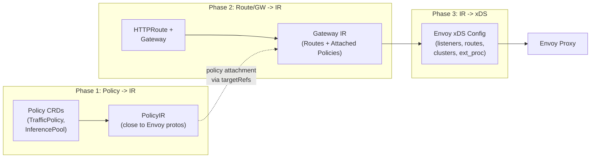
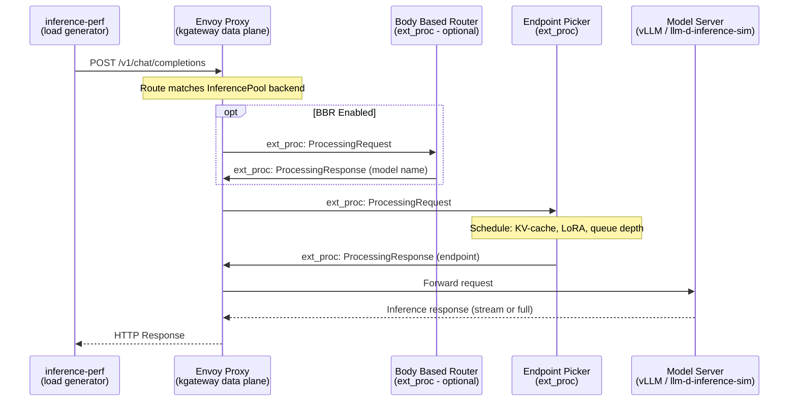
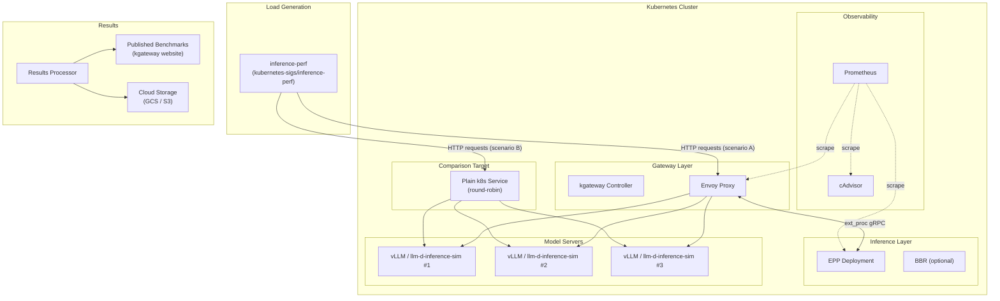
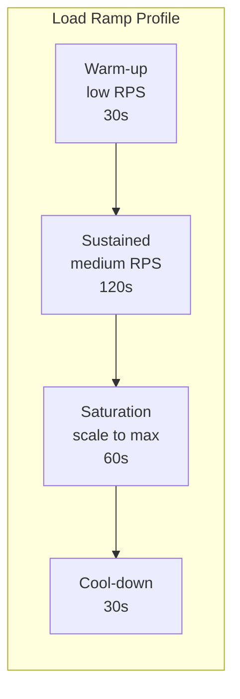
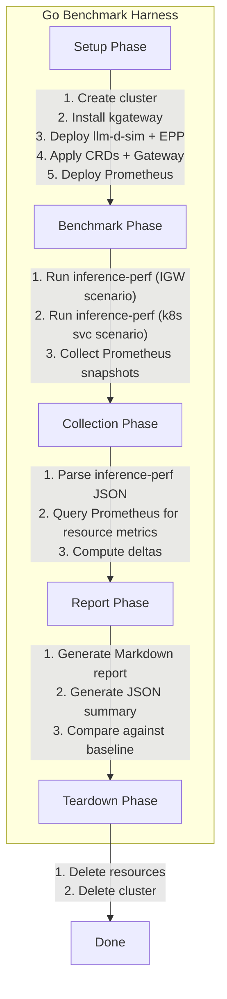
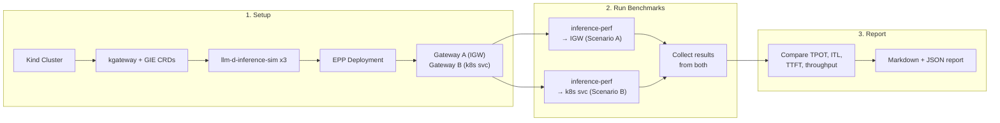
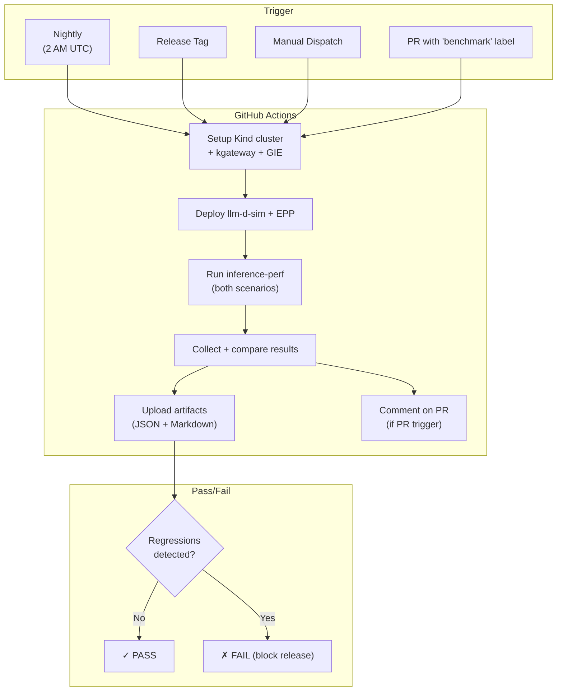
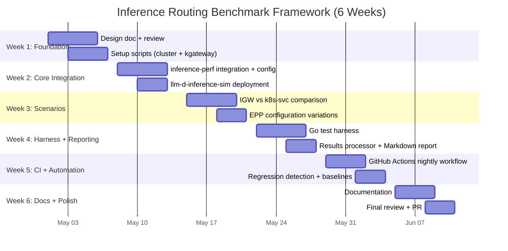

# Benchmarking and Performance Evaluation of Inference Routing Extensions in kgateway

## Table of Contents

- [1. Project Overview](#1-project-overview)
- [2. Background and Context](#2-background-and-context)
- [3. Architecture Deep-Dive](#3-architecture-deep-dive)
- [4. Scope: GSoC Core vs Stretch Goals](#4-scope-gsoc-core-vs-stretch-goals)
- [5. Benchmark Design](#5-benchmark-design)
- [6. Tools Selection and Analysis](#6-tools-selection-and-analysis)
- [7. Implementation Plan](#7-implementation-plan)
- [8. Metrics and Data Collection](#8-metrics-and-data-collection)
- [9. CI/CD Automation](#9-cicd-automation)
- [10. Documentation Plan](#10-documentation-plan)
- [11. Timeline and Milestones](#11-timeline-and-milestones)
- [12. TODO Checklist](#12-todo-checklist)

---

## 1. Project Overview

### Problem Statement

kgateway provides inference routing capabilities via the [Gateway API Inference Extension](https://github.com/kubernetes-sigs/gateway-api-inference-extension) (GIE). This integration enables model-aware routing, serving priority, and customizable load-balancing of self-hosted Generative AI models through Envoy's External Processing (ext_proc) filter.

There is currently **no standardized or reproducible way** to evaluate the performance impact of these inference routing extensions in kgateway. Specifically:
- No published benchmarks comparing kgateway (with inference extension) vs a standard Kubernetes service
- No reproducible test environment (script/automation) for users to validate results themselves
- No CI job running inference performance tests against the main branch
- No integration of perf regressions into the release process

### Goals

1. Publish reproducible benchmarks (TPOT, ITL, TTFT, E2E latency) comparing **kgateway + inference extension** vs **standard k8s service**
2. Build a **reproducible test environment** via scripts so users can validate benchmarks themselves
3. Implement **CI automation** (nightly/weekly) to run benchmarks against the `main` branch
4. Integrate benchmarks into the **release process** to prevent regressions from shipping
5. Document benchmark methodology, interpretation, and best practices

### Relationship to Existing Work

> [!IMPORTANT]
> This project is complementary to the existing control-plane load testing framework design ([design/11210](file:///home/shubham/Code/Personal/kgateway/design/11210-kgateway-load-testing-framework.md)), which focuses on route attachment/propagation times. **This proposal focuses on data-plane inference performance** — token latency, throughput, and routing overhead — using real or simulated GPU workloads.

### Reference: Upstream Benchmark

The GIE project already publishes benchmarks at [gateway-api-inference-extension.sigs.k8s.io/performance/benchmark](https://gateway-api-inference-extension.sigs.k8s.io/performance/benchmark/) using the [`inference-perf`](https://github.com/kubernetes-sigs/inference-perf) tool. Our goal is to build **kgateway-specific benchmarks** following the same methodology — referencing the upstream tool and integrating results into kgateway's own docs and release pipeline.

---

## 2. Background and Context

### What is the Gateway API Inference Extension (GIE)?

The GIE transforms any ext-proc-capable gateway (like kgateway/Envoy) into an **Inference Gateway** optimized for serving Generative AI workloads.

**Key Components:**

| Component | Description |
|-----------|-------------|
| **InferencePool** | K8s CRD defining a pool of model-serving backends (e.g., vLLM pods) |
| **Endpoint Picker (EPP)** | ext_proc server selecting the optimal backend based on KV-cache state, LoRA availability, request cost |
| **Body Based Router (BBR)** | Optional ext_proc server parsing request bodies to extract model names for routing |
| **InferenceModel** | CRD mapping client-facing model names to backend-specific models/adapters |

### How kgateway Integrates GIE

Based on [design/10411](file:///home/shubham/Code/Personal/kgateway/design/10411-gateway-api-inference-extension-support.md):
- GIE is implemented as a **kgateway plugin**
- The plugin manages Envoy's **External Processing Filter** (ext_proc) to route requests through the EPP
- **InferencePool** is a supported HTTPRoute backend reference
- A dedicated **deployer** manages EPP resources

### kgateway Architecture (Translation Pipeline)



---

## 3. Architecture Deep-Dive

### Inference Request Flow (What We Are Benchmarking)



### Benchmark Architecture



---

## 4. Scope: GSoC Core vs Stretch Goals

> [!IMPORTANT]
> The upstream issue includes requirements that need significant infrastructure (cloud GPU access, website publishing pipeline). We split these into **GSoC core deliverables** and **stretch goals** that can be pursued after the foundation is in place.

### GSoC Core Deliverables (6 Weeks)

| # | Deliverable | Description |
|---|------------|-------------|
| 1 | **Reproducible benchmark scripts** | One-command setup using `llm-d-inference-sim` (no GPU needed) |
| 2 | **inference-perf integration** | Wire up the upstream tool for kgateway-specific scenarios |
| 3 | **Comparison: IGW vs k8s service** | Side-by-side benchmarks with published results |
| 4 | **Metrics: TPOT, ITL, TTFT, E2E** | LLM-specific metrics matching upstream benchmark format |
| 5 | **CI job (nightly)** | GitHub Actions workflow against `main` branch |
| 6 | **Result storage + basic reporting** | Store JSON results as artifacts; generate Markdown summary |
| 7 | **Documentation** | Methodology, interpretation guide, how to reproduce |

### Stretch Goals (Beyond GSoC, or bonus if time allows)

| # | Stretch Goal | Description | Blocker |
|---|-------------|-------------|---------|
| S1 | **Real GPU test env (B100)** | Run on latest cloud GPUs from major providers | Needs cloud GPU quota/budget |
| S2 | **Published benchmark page** | Integrate results into kgateway website (like GIE does) | Needs website infra access |
| S3 | **Release process gate** | Block kgateway releases on perf regressions | Needs maintainer sign-off on thresholds |
| S4 | **llm-d perf test integration** | Investigate and cross-reference with `llm-d` benchmarks | Depends on llm-d project stability |
| S5 | **GPU utilization metrics** | Accelerator-level metrics (GPU util, memory, power) | Needs `inference-perf` roadmap feature |

---

## 5. Benchmark Design

### 5.1. Primary Comparison: IGW vs k8s Service

This directly mirrors the [upstream GIE benchmark](https://gateway-api-inference-extension.sigs.k8s.io/performance/benchmark/):

| Scenario | Target | Description |
|----------|--------|-------------|
| **Scenario A** | kgateway + InferencePool (IGW) | Inference-aware routing via EPP |
| **Scenario B** | kgateway + plain k8s Service | Standard round-robin load balancing |

Both scenarios send traffic to **the same pool of model server pods**, but differ in how the gateway routes them. Running both simultaneously via separate `inference-perf` instances allows a fair apples-to-apples comparison.

### 5.2. Additional Scenarios (Beyond Upstream)

These go deeper than the upstream GIE benchmark, providing kgateway-specific insights:

#### EPP Configuration Variations

| Configuration | Description |
|--------------|-------------|
| **Default EPP** | Standard scheduling with queue-depth awareness |
| **EPP + BBR** | Body Based Router adds model-name extraction |
| **LoRA-aware EPP** | Routing to pods with specific LoRA adapters loaded |
| **Multi-InferenceModel** | Multiple model→adapter mappings in one pool |

#### Workload Variations

| Workload | Input/Output | Notes |
|----------|-------------|-------|
| **Short prompt** | ~100 input / 100 output tokens | Fast, frequent requests |
| **Long context** | ~2000 input / 200 output tokens | Tests KV-cache scheduling |
| **Streaming** | Any | Tests TTFT and inter-chunk latency |
| **Multi-turn chat** | Shared prefix | Tests prefix-cache-aware scheduling |
| **Multi-LoRA** | Mixed adapter traffic | Tests LoRA scheduling |

### 5.3. Load Profiles



`inference-perf` supports Gaussian, fixed-length, and min-max input/output distributions, plus burst traffic patterns. We will use its built-in load profiles rather than custom ones.

### 5.4. Model Server: `llm-d-inference-sim` (No GPU Required)

For the core GSoC deliverables, we use [`llm-d/llm-d-inference-sim`](https://github.com/llm-d/llm-d-inference-sim) instead of building a mock server from scratch. It provides:

- OpenAI-compatible `/v1/chat/completions` (HTTP + gRPC)
- Realistic TTFT simulation (prefill phase latency with jitter)
- Realistic inter-token latency (decode phase)
- Load-adaptive latency (gets slower under concurrency, like real vLLM)
- vLLM-compatible Prometheus `/metrics` (KV-cache, queue depth, LoRA)
- LoRA adapter lifecycle simulation
- Docker image available — load into Kind directly

This saves ~1.5 weeks of work compared to writing a mock server and gives the EPP **real signals to make scheduling decisions**, making the benchmark more meaningful.

> [!NOTE]
> For Stretch Goal S1 (real GPU env), replace `llm-d-inference-sim` with actual vLLM instances running on B100 nodes. The rest of the framework is identical.

---

## 6. Tools Selection and Analysis

### 6.1. Primary Load Generation: `inference-perf`

> [!TIP]
> **We align with the upstream choice: [`kubernetes-sigs/inference-perf`](https://github.com/kubernetes-sigs/inference-perf)** — the standardized GenAI inference benchmarking tool from the Kubernetes `wg-serving` working group.

**Why `inference-perf`?**

| Reason | Detail |
|--------|--------|
| **Official upstream tool** | Used by GIE for their published benchmarks; aligns kgateway with community standards |
| **LLM-aware metrics** | Natively measures TPOT, ITL, TTFT, E2E latency — not retrofitted |
| **Model-server agnostic** | Works with vLLM, SGLang, TGI, llm-d, Inference Gateway |
| **Real-world datasets** | ShareGPT, HuggingFace datasets; Gaussian/fixed/min-max distributions |
| **Built-in load patterns** | Burst traffic, scaling to saturation, multi-LoRA traffic splitting |
| **Multi-turn conversations** | Maintains prefix context across turns (critical for KV-cache testing) |
| **Deployment as K8s Job** | Runs inside the cluster — accurate latency, no external network overhead |

**Alternative: k6**

k6 is a general-purpose HTTP load generator. It is excellent for gateway/API benchmarking but:
- Does not natively understand LLM semantics (TPOT, ITL require custom metric definitions)
- Has no concept of token distributions or chat datasets
- Would require significant custom scripting to match what `inference-perf` does out-of-the-box

> **Decision:** Use `inference-perf` as the primary tool for all LLM inference benchmarks. A lightweight Go test harness orchestrates the setup/teardown and wraps `inference-perf` invocations. For gateway-specific HTTP benchmarks (routing overhead without LLM context), `vegeta` or a simple Go HTTP client can supplement.

### 6.2. Model Server: `llm-d-inference-sim`

| Option | Pros | Cons |
|--------|------|------|
| **`llm-d-inference-sim`** (recommended) | Physics-based latency sim, real vLLM metrics, LoRA support, GPU-free, maintained by GIE ecosystem | External dependency |
| **GIE's own vLLM sim** | Simpler, directly from upstream | Less realistic; limited metric simulation |
| **Custom Go mock server** | Full control, no dependency | ~1.5 weeks of work; less realistic EPP signals |
| **Real vLLM (GPU)** | Most realistic | Requires GPU hardware; not available in CI |

**Decision:** `llm-d-inference-sim` for core work; real vLLM as a stretch goal.

### 6.3. Metrics Collection: Prometheus

| Component | Purpose |
|-----------|---------|
| **Prometheus** | Scrape Envoy, EPP, model server, cAdvisor |
| **cAdvisor** | Container-level CPU/memory overhead |
| **`inference-perf` built-in** | LLM metrics (TPOT, ITL, TTFT) natively reported |

### 6.4. Result Storage

| Location | Use Case |
|----------|----------|
| **GitHub Actions Artifacts** | Per-run results (immediate, no external dependency) |
| **Cloud Storage (GCS/S3)** | Long-term historical storage for trend analysis *(stretch goal)* |
| **kgateway website** | Published benchmark page *(stretch goal)* |

---

## 7. Implementation Plan

### 7.1. Directory Structure

```
test/
  benchmark/
    README.md                              # Quick start and overview
    Makefile                               # make benchmark, make benchmark-baseline, etc.
    setup/
      kind-cluster.sh                      # Reproducible cluster setup script
      install-kgateway.sh                  # kgateway install with inference extension enabled
      install-inference-perf.sh            # inference-perf tool setup
    manifests/
      gateway-igw.yaml                     # Gateway + HTTPRoute -> InferencePool (Scenario A)
      gateway-k8s-svc.yaml                 # Gateway + HTTPRoute -> Service (Scenario B)
      inferencepool.yaml                   # InferencePool + InferenceModel CRDs
      llm-d-sim.yaml                       # llm-d-inference-sim Deployment + Service
      epp.yaml                             # EPP Deployment + Service
      prometheus.yaml                      # Prometheus stack
    inference-perf/
      config-igw.yaml                      # inference-perf config for Scenario A
      config-k8s-svc.yaml                  # inference-perf config for Scenario B
      config-multilora.yaml                # Multi-LoRA workload config
      config-streaming.yaml                # Streaming workload config
    harness/
      benchmark_test.go                    # Go test entry points (testify)
      setup.go                             # Cluster + resource setup
      teardown.go                          # Cleanup
      results.go                           # Results collection + comparison
      report.go                            # Markdown report generation
    results/
      baseline/
        benchmark-results.json             # Committed baseline for regression detection
    docs/
      methodology.md
      interpreting-results.md
      best-practices.md
```

### 7.2. `inference-perf` Configuration

`inference-perf` is config-driven (YAML). Example for the IGW scenario:

```yaml
# inference-perf/config-igw.yaml
server:
  base_url: "http://${GATEWAY_IP}:${GATEWAY_PORT}"  # kgateway Envoy address

dataset:
  type: "sharegpt"                         # Real-world conversation dataset
  path: "ShareGPT_V3_unfiltered_cleaned_split.json"

load:
  mode: "constant_rate"
  rate: 50                                  # requests/sec
  duration: "300s"

tokenizer:
  model: "meta-llama/Llama-2-7b-chat-hf"   # For accurate token counting

output:
  storage: "local"
  path: "/results/igw-benchmark.json"
```

### 7.3. Go Test Harness (Orchestrator)



### 7.4. Benchmark Execution Flow



---

## 8. Metrics and Data Collection

### 8.1. Primary LLM Inference Metrics

These match the upstream GIE benchmark format:

| Metric | Full Name | Description | Source |
|--------|-----------|-------------|--------|
| **TPOT** | Time Per Output Token | Average time between generated tokens | `inference-perf` |
| **ITL** | Inter-Token Latency | Latency between consecutive tokens in a stream | `inference-perf` |
| **TTFT** | Time to First Token | Time from request to first response token | `inference-perf` |
| **E2E latency** | End-to-end latency (p50/p95/p99) | Total request duration | `inference-perf` |
| **Throughput** | Tokens/sec and Requests/sec | System capacity | `inference-perf` |
| **Error rate** | Failed requests % | Stability under load | `inference-perf` |

### 8.2. Resource Overhead Metrics

| Metric | Target | Source |
|--------|--------|--------|
| **CPU usage** | Envoy proxy, EPP, BBR, kgateway controller | Prometheus + cAdvisor |
| **Memory usage** | Envoy proxy, EPP, BBR | Prometheus + cAdvisor |
| **IGW vs k8s delta** | CPU/memory overhead of inference routing | Calculated |

### 8.3. Envoy / EPP-Specific Metrics

| Metric | Source |
|--------|--------|
| `envoy_ext_proc_streams_started` | Envoy admin stats |
| `envoy_ext_proc_streams_msgs_sent` | Envoy admin stats |
| `envoy_http_downstream_rq_time_bucket` | Envoy histograms (routing latency) |
| `envoy_cluster_upstream_rq_time_bucket` | Envoy histograms (EPP call latency) |

### 8.4. Report Format

```json
{
  "timestamp": "2026-04-01T00:00:00Z",
  "kgateway_version": "v2.3.0",
  "model": "llama2-7b",
  "scenarios": {
    "igw": {
      "tpot_ms": 12.4,
      "itl_ms": 11.8,
      "ttft_ms": 45.2,
      "e2e_p50_ms": 1240,
      "e2e_p99_ms": 3100,
      "throughput_tokens_per_sec": 810,
      "error_rate": 0.001
    },
    "k8s_service": {
      "tpot_ms": 12.1,
      "itl_ms": 11.5,
      "ttft_ms": 28.3,
      "e2e_p50_ms": 1210,
      "e2e_p99_ms": 2950,
      "throughput_tokens_per_sec": 840,
      "error_rate": 0.001
    }
  },
  "overhead": {
    "ttft_delta_ms": 16.9,
    "epp_cpu_millicores": 145,
    "epp_memory_mb": 92
  }
}
```

---

## 9. CI/CD Automation

### 9.1. CI Workflow



### 9.2. Makefile Targets

```makefile
.PHONY: benchmark
benchmark: ## Run all inference routing benchmarks (IGW vs k8s-svc)
	cd test/benchmark && $(MAKE) run-all

.PHONY: benchmark-setup
benchmark-setup: ## Set up benchmark environment (cluster + dependencies)
	bash test/benchmark/setup/kind-cluster.sh
	bash test/benchmark/setup/install-kgateway.sh
	bash test/benchmark/setup/install-inference-perf.sh

.PHONY: benchmark-igw
benchmark-igw: ## Run inference gateway (IGW) scenario only
	cd test/benchmark && $(MAKE) run-igw

.PHONY: benchmark-k8s-svc
benchmark-k8s-svc: ## Run plain k8s service scenario only
	cd test/benchmark && $(MAKE) run-k8s-svc

.PHONY: benchmark-report
benchmark-report: ## Generate report from latest results
	cd test/benchmark && $(MAKE) report

.PHONY: benchmark-compare
benchmark-compare: ## Compare latest vs committed baseline (regression check)
	cd test/benchmark && $(MAKE) compare
```

---

## 10. Documentation Plan

| Document | Location | Description |
|----------|----------|-------------|
| **Benchmark README** | `test/benchmark/README.md` | Quick start: run in 5 minutes |
| **Methodology** | `test/benchmark/docs/methodology.md` | Scenario rationale, assumptions, limitations |
| **Interpreting Results** | `test/benchmark/docs/interpreting-results.md` | What TPOT/ITL/TTFT mean, how to read the report |
| **Reproducing Benchmarks** | `test/benchmark/docs/reproducing.md` | Step-by-step guide for users to reproduce locally |
| **Best Practices** | `test/benchmark/docs/best-practices.md` | EPP tuning, InferencePool sizing, perf tips |
| **Design Document** | `design/XXXX-inference-routing-benchmarks.md` | Formal EP following kgateway template |

---

## 11. Timeline and Milestones

### 6-Week GSoC Timeline



### Milestone Deliverables

| Week | Milestone | Deliverables |
|------|-----------|-------------|
| **1** | Foundation | Design doc approved, cluster setup scripts |
| **2** | Core Integration | `inference-perf` running against kgateway, `llm-d-sim` deployed |
| **3** | Scenarios | IGW vs k8s-svc results, EPP config variations |
| **4** | Harness | Go test harness, Markdown + JSON report generation |
| **5** | CI | Nightly CI workflow, regression detection |
| **6** | Polish | Full documentation, final PR |

---

## 12. TODO Checklist

### Phase 1: Foundation (Week 1)

- [ ] Write formal design document (`design/XXXX-inference-routing-benchmarks.md`)
- [ ] Get design doc reviewed by maintainers
- [ ] Write `test/benchmark/setup/kind-cluster.sh` (reproducible Kind cluster)
- [ ] Write `test/benchmark/setup/install-kgateway.sh` (with inference extension enabled)
- [ ] Write `test/benchmark/setup/install-inference-perf.sh`
- [ ] Create baseline Kubernetes manifests (Gateway, HTTPRoute, Service, InferencePool, InferenceModel)

### Phase 2: Core Integration (Week 2)

- [ ] Deploy `llm-d/llm-d-inference-sim` with vLLM-compatible metrics
- [ ] Deploy EPP configured to scrape `llm-d-sim` metrics
- [ ] Write `inference-perf/config-igw.yaml` (IGW scenario config)
- [ ] Write `inference-perf/config-k8s-svc.yaml` (k8s service scenario config)
- [ ] Validate end-to-end: requests flow through kgateway → EPP → llm-d-sim

### Phase 3: Benchmark Scenarios (Week 3)

- [ ] Run IGW vs k8s-svc comparison and record raw results
- [ ] Write `inference-perf/config-multilora.yaml` (LoRA-aware scheduling)
- [ ] Write `inference-perf/config-streaming.yaml` (TTFT / ITL focus)
- [ ] Test EPP + BBR configuration variant
- [ ] Validate TPOT, ITL, TTFT metric output from `inference-perf`

### Phase 4: Harness and Reporting (Week 4)

- [ ] Implement Go test harness (`harness/benchmark_test.go`, `setup.go`, `teardown.go`)
- [ ] Implement results collection (`harness/results.go`) — parse inference-perf JSON + Prometheus
- [ ] Implement Markdown report generator (`harness/report.go`)
- [ ] Commit baseline results (`results/baseline/benchmark-results.json`)
- [ ] Add `make benchmark-compare` regression detection

### Phase 5: CI Automation (Week 5)

- [ ] Create `.github/workflows/benchmark.yaml`
  - [ ] Nightly schedule trigger
  - [ ] Release tag trigger
  - [ ] Manual dispatch trigger
  - [ ] PR label-gated trigger
- [ ] Upload JSON + Markdown results as workflow artifacts
- [ ] Post PR comment with benchmark summary
- [ ] Add `make benchmark-*` targets to root Makefile

### Phase 6: Documentation (Week 6)

- [ ] Write `test/benchmark/README.md` (quick start)
- [ ] Write `test/benchmark/docs/methodology.md`
- [ ] Write `test/benchmark/docs/interpreting-results.md`
- [ ] Write `test/benchmark/docs/reproducing.md`
- [ ] Write `test/benchmark/docs/best-practices.md`
- [ ] Final PR review and merge

### Stretch Goals (Post-GSoC)

- [ ] **S1**: Provision B100 GPU environment on GCP/Azure/AWS
- [ ] **S2**: Publish benchmark results page on kgateway website
- [ ] **S3**: Gate releases on inference perf regressions (integrate into release workflow)
- [ ] **S4**: Cross-reference with `llm-d` benchmark results
- [ ] **S5**: GPU utilization metrics (await `inference-perf` roadmap)

---

## User Review Required

> [!IMPORTANT]
> **Questions for the contributor before starting:**
> 1. Do you have (or can you request) cloud GPU quota for the Stretch Goal S1 (B100 GPU environment)?
> 2. Should the design document follow kgateway's existing EP template (`design/template.md`)?
> 3. For CI, should we start with nightly-only or also add a weekly "heavier" run with more load scenarios?
> 4. Do you have access to the kgateway website repo to eventually publish benchmark results (Stretch Goal S2)?
> 5. Is `llm-d-inference-sim` acceptable as the model server dependency, or would the maintainers prefer the simpler GIE vLLM simulator for less external coupling?
